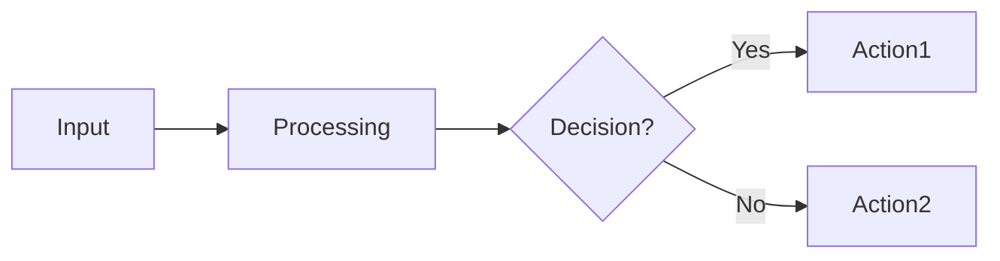

# Template Prompt per Brainstorming Nuove Feature

> **ISTRUZIONI**: 
> 1. Copia questo file
> 2. Sostituisci tutti i `[PLACEHOLDER]` con i tuoi valori
> 3. Copia & incolla il prompt compilato in ChatGPT/Claude/Gemini
> 4. Salva l'output dell'AI come indicato in fondo

---

# PROMPT DA COPIARE (INIZIO)

---

# CONTEXT: Trading System Architecture

Sto sviluppando un **Trading System automatizzato** con questa architettura:

## Stack Tecnologico

**Backend:**
- .NET 10, C# 13
- Dapper (micro-ORM)
- Serilog (logging)

**Database:**
- SQLite (locale per ogni servizio)
- PostgreSQL (cloud via Cloudflare D1)

**Frontend:**
- React 18 + TypeScript
- Vite (build tool)
- Bun (runtime/package manager)
- TanStack Query (data fetching)
- Zustand (state management)

**Infrastructure:**
- Cloudflare Workers (API gateway con Hono framework)
- Windows Services (.NET BackgroundService)
- Interactive Brokers TWS API (trading integration)

---

## Servizi Esistenti

### 1. TradingSupervisorService (Windows Service)

**Responsabilità:**
- Monitora salute sistema (CPU, RAM, disk, uptime)
- Verifica stato servizi Windows
- Raccoglie metriche real-time
- SQLite DB: `supervisor.db`

**Componenti principali:**
- `MetricsCollectionWorker.cs`: Raccolta metriche ogni 60s
- `ServiceMonitorWorker.cs`: Check salute servizi
- `Data/SupervisorRepository.cs`: Persistenza metrics

### 2. OptionsExecutionService (Windows Service)

**Responsabilità:**
- Esegue strategie di trading su options
- Connessione IBKR TWS
- Position tracking
- Order management (paper trading default)
- SQLite DB: `options.db`

**Componenti principali:**
- `StrategyExecutionWorker.cs`: Carica ed esegue strategie
- `PositionMonitorWorker.cs`: Monitora posizioni aperte
- `IbkrClient.cs`: Wrapper IBKR TWS API
- `Data/OptionsRepository.cs`: Persistenza orders/positions

### 3. Dashboard (React SPA)

**Responsabilità:**
- Monitoring real-time metriche sistema
- Visualizzazione posizioni e P&L
- Gestione strategie (upload JSON)
- UI per configurazione

**Tech stack:**
- React 18, TypeScript strict mode
- TanStack Query per data fetching
- Recharts per grafici
- Tailwind CSS per styling

### 4. Cloudflare Worker (API Gateway)

**Responsabilità:**
- Endpoint REST per dashboard
- Cloudflare D1 (PostgreSQL-compatible)
- Replica dati da servizi Windows
- Rate limiting e auth

---

## Vincoli Non-Negoziabili (CRITICAL)

Queste regole DEVONO essere rispettate in OGNI design:

### Security & Safety
- ✅ **TradingMode default = "paper"** (mai "live" senza conferma esplicita)
- ✅ **Nessun secret committato** (API keys, passwords in environment variables)
- ✅ **strategies/private/ sempre in .gitignore**

### IBKR API
- ✅ **Rate limiting**: max 1 order ogni 2 secondi
- ✅ **Connection handling**: reconnect automatico con backoff esponenziale
- ✅ **Error handling**: ogni chiamata IBKR wrappata in try/catch con log

### SQLite
- ✅ **PRAGMA journal_mode=WAL** (sempre)
- ✅ **PRAGMA busy_timeout=5000** (prevent lock errors)
- ✅ **PRAGMA synchronous=NORMAL**
- ✅ **PRAGMA foreign_keys=ON**

### Coding Standards C#
- ✅ **Early return pattern** (no else dopo return)
- ✅ **Negative-first conditionals** (check errore prima di success)
- ✅ **Typed signatures** (no var per tipi non ovvi, no object, no dynamic)
- ✅ **Try/catch su OGNI IO operation** (DB, file, HTTP, IBKR)
- ✅ **Verbose inline comments** su logica non banale
- ✅ **Record immutabili** per DTO (init properties)

### Coding Standards TypeScript
- ✅ **Strict mode** (`"strict": true` in tsconfig)
- ✅ **No any** (tipizzazione esplicita)
- ✅ **React Query** per data fetching (no useEffect)
- ✅ **Functional components** con hooks (no class components)

---

## Knowledge Base Esistente

Il sistema ha già implementato 128+ lezioni apprese e risolto 45+ errori critici:

**Errori Noti (esempi top 5):**
1. ERR-042: SQLite "database is locked" → Fix: busy_timeout=5000
2. ERR-018: Concurrent writes fail → Fix: WAL mode
3. ERR-067: Worker crash on shutdown → Fix: handle OperationCanceledException
4. ERR-089: IBKR rate limit exceeded → Fix: throttle con 2s delay
5. ERR-112: PerformanceCounter richiede admin → Fix: fallback graceful

**Performance Patterns:**
- Background workers: max 60s interval (trade-off CPU vs freshness)
- SQLite queries: ALWAYS use indexes on WHERE/ORDER BY columns
- React Query: staleTime=30s per metrics, 60s per positions

**Architectural Decisions:**
- No ORM (Dapper only) → performance + control
- Separate SQLite DB per service → isolation
- Paper trading default → safety-first
- Cloudflare D1 per cloud replica → dashboard accessibile ovunque

---

# FEATURE DA ANALIZZARE

## Nome Feature
**[NOME-FEATURE]**

Esempio: "Alert System Real-Time via Email"

## Obiettivo Business
**[OBIETTIVO-BUSINESS]**

Esempio: "Notificare Lorenzo via email quando una posizione raggiunge +10% profit o -5% loss, per poter prendere azioni tempestive senza monitorare dashboard 24/7"

## User Story (se applicabile)
```
As a [RUOLO-UTENTE]
I want to [AZIONE-DESIDERATA]
So that [BENEFICIO-ATTESO]
```

Esempio:
```
As a trader
I want to receive email alerts when position thresholds are crossed
So that I can take timely action without monitoring dashboard continuously
```

## Dettagli Feature

### Trigger / Input
**[QUANDO-SI-ATTIVA-FEATURE]**

Esempio: "Ogni 60 secondi, PositionMonitorWorker check posizioni aperte contro regole alert configurate"

### Processing / Logic
**[COSA-FA-LA-FEATURE]**

Esempio: "Se position P&L% supera threshold configurato, sistema invia email e logga evento in alert_history"

### Output / Result
**[RISULTATO-FINALE]**

Esempio: "Email arriva a lorenzo@padosoft.com entro 2 minuti da trigger, con dettagli posizione e P&L"

### Edge Cases Noti
**[CASI-LIMITE-CRITICI]**

Esempio:
- Cosa succede se SMTP server è down?
- Cosa succede se posizione oscilla intorno a threshold?
- Cosa succede con 100+ posizioni che triggerano simultaneamente?

---

# COMPITI PER L'AI

Analizza questa feature e **produci i seguenti file**:

## File 1: `00-DESIGN.md`

### Struttura OBBLIGATORIA:

```markdown
# Feature: [Nome Feature]

## 1. Obiettivo
[2-3 frasi che spiegano COSA fa e PERCHÉ serve]

## 2. Requisiti Funzionali
- REQ-F-01: [User story format con Given/When/Then]
- REQ-F-02: [...]
- REQ-F-03: [...]

## 3. Requisiti Non-Funzionali
- PERF-01: [Performance requirement con metrica misurabile]
- SEC-01: [Security requirement]
- OPS-01: [Operability requirement]
- REL-01: [Reliability requirement]

## 4. Architettura

### 4.1 Componenti da Creare (nuovi)
Per ogni nuovo componente:
```
Component: [Nome]
Location: src/[Nome]/
Type: [Class Library / Worker Service / etc]
Responsabilità:
- [Responsibility 1]
- [Responsibility 2]

Files:
- [File1.cs] (description)
- [File2.cs] (description)

Dependencies:
- [Package1] version X.Y
- [Package2] version X.Y
```

### 4.2 Componenti da Modificare (esistenti)
Per ogni componente modificato:
```
Component: [Nome esistente]
File: path/to/File.cs
Changes:
- Line ~XX: [Cosa aggiungere/modificare]
- Line ~YY: [...]

Rationale: [Perché questa modifica è necessaria]
```

### 4.3 Data Flow Diagram


### 4.4 Database Schema Changes
```sql
-- Migration: YYYY-MM-DD-description.sql

CREATE TABLE table_name (
    id INTEGER PRIMARY KEY AUTOINCREMENT,
    col1 TEXT NOT NULL,
    col2 REAL,
    created_at TEXT NOT NULL
);

CREATE INDEX idx_name ON table_name(col1);
```

**Rationale**: [Perché queste colonne, questi tipi, questi indici]

## 5. Task Breakdown

Dividi in task atomici (max 4 ore per task):

⚠️ **SEMPRE iniziare da T-00 (Setup Task) - OBBLIGATORIO!**

### Phase 1: Foundation
- **T-00: Setup** (SEMPRE OBBLIGATORIO)
  - Infrastructure setup (D1, secrets, API keys)
  - Verifica build pulito baseline
  - Installazione dependencies (NuGet, npm, bun)
  - Setup environment variables
  - Creazione database/tabelle se nuovi
  - Verifica tutti i prerequisiti ready
  
- T-01: Database schema + migration
- T-02: Domain models

### Phase 2: Implementation
- T-03: Core business logic
- T-04: Integration layer
- T-05: Worker/service integration

### Phase 3: UI (se applicabile)
- T-06: Dashboard components
- T-07: API endpoints

### Phase 4: Testing
- T-08: Unit tests
- T-09: Integration tests
- T-10: E2E checklist

**Naming Rule**: Usa SEMPRE T-00, T-01, T-02, ... (sequenziale)
**MAI** usare T-SW-01, T-BOT-01, T-FEATURE-01 (il sistema non li riconosce!)

## 6. Dependencies & Configuration

### NuGet Packages (se nuovi)
```xml
<PackageReference Include="PackageName" Version="X.Y.Z" />
```

### Configuration Changes
```json
// appsettings.json
{
  "NewSection": {
    "Setting1": "value",
    "Setting2": 123
  }
}
```

### Environment Variables (secrets)
```
NEW_SECRET=xxx
```

## 7. Rischi & Mitigazioni

| ID | Rischio | P | I | Mitigazione |
|---|---|---|---|---|
| R-01 | [Descrizione] | H/M/L | H/M/L | [Azione concreta] |

## 8. Rollback Plan

Se feature causa problemi in production:
1. [Step immediato — config change]
2. [Step DB — rollback migration]
3. [Step codice — git revert]

Tempo stimato rollback: [X minuti]

## 9. Success Criteria

### Functional
- [ ] [Criterion 1 — testabile]
- [ ] [Criterion 2]

### Non-Functional
- [ ] Performance: [metrica] < [threshold]
- [ ] Security: [check]
- [ ] Reliability: [check]

### Testing
- [ ] Unit tests: PASS
- [ ] Integration tests: PASS
- [ ] E2E checklist: PASS
- [ ] No regression: PASS

## 10. Testing Strategy

### Unit Tests
```csharp
[Fact]
public void TestName()
{
    // Arrange
    // Act
    // Assert
}
```

### Integration Tests
```csharp
[Fact]
public async Task IntegrationTestName()
{
    // End-to-end scenario
}
```

### E2E Manual Checklist
```markdown
## Prerequisites
- [ ] [Setup step 1]

## Test Steps
1. [ ] [Step 1]
2. [ ] [Step 2]

## Expected Results
- [Result 1]
```
```

---

## File 2-N: `T-XX.md` (Task Files)

⚠️ **IMPORTANTE - Naming Convention**:
- **SEMPRE** usa numerazione sequenziale: `T-00.md`, `T-01.md`, `T-02.md`, ...
- **MAI** usare prefissi come `T-SW-01`, `T-BOT-01`, `T-FEATURE-01`
- **SEMPRE** inizia da `T-00-setup.md` (setup task)
- Se ci sono più feature/componenti, usa task sequenziali (T-01, T-02, ...) per tutti

**Esempio CORRETTO**:
```
T-00-setup.md
T-01-wizard-identity.md
T-02-wizard-legs.md
T-03-bot-setup.md
T-04-bot-commands.md
```

**Esempio SBAGLIATO** (❌ NON fare così):
```
T-SW-01-identity.md  ← SBAGLIATO! Usa T-01
T-SW-02-legs.md      ← SBAGLIATO! Usa T-02
T-BOT-01-setup.md    ← SBAGLIATO! Usa T-03
```

---

Per OGNI task nel breakdown, crea un file separato:

### Template Task File:

```markdown
# T-XX — [Titolo Task]

## Obiettivo
[1 frase — cosa produce questo task]

## Dipendenze
[T-YY, T-ZZ] — quali task devono essere completati prima

## Pre-Task Knowledge Check

### 1. Rules (auto-loaded)
.claude/rules/*.md già in context

### 2. claude-mem Search (se disponibile)
```
/mem-search "[keyword-rilevante]"
```

### 3. Error Registry Check
```bash
grep -i "[domain-keyword]" knowledge/errors-registry.md
```

## Checklist
- [ ] [Action item 1]
- [ ] [Action item 2]
- [ ] [Action item 3]

## Implementazione

### Files da Creare
```csharp
// src/Path/NewFile.cs
namespace TradingSystem.Path;

public sealed class ClassName
{
    // Skeleton implementation
}
```

### Files da Modificare
```csharp
// src/Path/ExistingFile.cs
// Line ~45: Aggiungi questo
private readonly INewDependency _dep;

// Line ~120: Modifica questo metodo
public async Task MethodName()
{
    // Nuovo codice
}
```

## Test Criteria
- TEST-XX-01: [Descrizione test specifico — cosa testi e risultato atteso]
- TEST-XX-02: [...]

## Done Criteria
- [ ] Build pulito (0 errori)
- [ ] Tutti i test TEST-XX-YY: PASS
- [ ] No regression (existing tests still PASS)
- [ ] .agent-state.json: "T-XX" = "done"
- [ ] Log prodotto: logs/T-XX-result.md

## Stima
~[N] ore

---
**Feature**: [Nome Feature]
**Created**: [Data]
```

---

# OUTPUT RICHIESTO

Alla fine della tua analisi, produci:

1. **00-DESIGN.md** completo seguendo la struttura sopra
2. **T-00.md** (Setup task)
3. **T-01.md** (primo task implementativo)
4. **T-02.md**, **T-03.md**, ... fino all'ultimo task
5. Almeno **1 task di testing** (es: T-08 con integration tests)

---

**IMPORTANTE — FORMAT OUTPUT**:

Separa ogni file con questa intestazione:

```
========================================
FILE: 00-DESIGN.md
========================================
[contenuto del file]

========================================
FILE: T-00-setup.md
========================================
[contenuto del file]

========================================
FILE: T-01-database-schema.md
========================================
[contenuto del file]

...
```

In questo modo posso copiare facilmente ogni file.

---

# PROMPT DA COPIARE (FINE)

---

## Cosa Fare con l'Output

Dopo aver ricevuto l'output dall'AI:

### Step 1: Salva i File

Crea directory temporanea:
```bash
mkdir -p /tmp/trading-feature-analysis
```

### Step 2: Estrai Ogni File

Copia ogni sezione separata da `========================================` in un file separato:

```bash
# Manualmente o con script
# 00-DESIGN.md → /tmp/trading-feature-analysis/00-DESIGN.md
# T-00-setup.md → /tmp/trading-feature-analysis/T-00-setup.md
# T-01-...md → /tmp/trading-feature-analysis/T-01-...md
# ...
```

### Step 3: Verifica Completezza

```bash
ls -la /tmp/trading-feature-analysis/
# Expected:
# - 00-DESIGN.md (almeno 5KB)
# - T-00-setup.md
# - T-01-xxx.md
# - T-02-xxx.md
# - ... (minimo 5 task total)
```

### Step 4: Procedi con Workflow

Ora segui **STEP 2** in [`docs/WORKFLOW-NUOVE-FEATURE.md`](./WORKFLOW-NUOVE-FEATURE.md):
```bash
./scripts/start-new-feature.sh "nome-feature"
```

---

## Esempio Completo (Alert System)

**Sostituzioni nel template:**

```
[NOME-FEATURE] → "Alert System Real-Time"

[OBIETTIVO-BUSINESS] → "Notificare Lorenzo via email quando posizione raggiunge +10% profit o -5% loss"

[RUOLO-UTENTE] → "trader"
[AZIONE-DESIDERATA] → "receive email alerts when thresholds are crossed"
[BENEFICIO-ATTESO] → "I can take action without continuous monitoring"

[QUANDO-SI-ATTIVA-FEATURE] → "Every 60s, PositionMonitorWorker checks positions vs alert rules"

[COSA-FA-LA-FEATURE] → "If P&L% exceeds threshold, send email via SMTP and log to alert_history"

[RISULTATO-FINALE] → "Email delivered within 2 minutes with position details"

[CASI-LIMITE-CRITICI] →
- SMTP server down → queue and retry after 5min
- Position oscillates → require 2 consecutive checks (hysteresis)
- 100+ alerts → rate limit 10 email/min
```

---

**Template Version**: 1.0  
**Last Updated**: 2026-04-05  
**File Location**: `docs/BRAINSTORMING-PROMPT-TEMPLATE.md`
