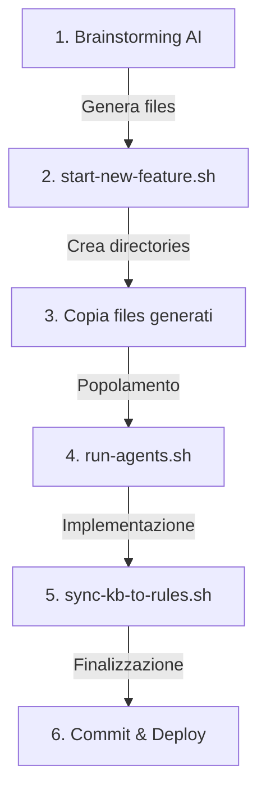

# Quick Start — Nuova Feature

> **PER**: Lorenzo e collaboratori Padosoft  
> **SCOPO**: Riferimento rapido per implementare nuove feature  
> **PREREQUISITI**: .NET 10 SDK installato, Claude CLI configurato

---

## ✅ Sequenza Corretta — Verificata

La tua sequenza è **CORRETTA**! Ecco confermato step-by-step:



---

## Procedura in 6 Step (The Right Way™)

### 📋 STEP 1: Brainstorming con AI

**File da usare**: [`docs/BRAINSTORMING-PROMPT-TEMPLATE.md`](./BRAINSTORMING-PROMPT-TEMPLATE.md)

**Azioni**:
1. Apri il file template
2. Sostituisci i `[PLACEHOLDER]`:
   - `[NOME-FEATURE]` → es: "Alert System"
   - `[OBIETTIVO-BUSINESS]` → es: "Email alerts su threshold posizioni"
   - `[RUOLO-UTENTE]`, `[AZIONE-DESIDERATA]`, `[BENEFICIO-ATTESO]`
   - Altri placeholder nelle sezioni "Dettagli Feature"

3. Copia il prompt compilato

4. Apri ChatGPT/Claude/Gemini e incolla

5. **Salva tutto l'output** in directory temporanea:
   ```bash
   mkdir -p /tmp/feature-analysis
   
   # Estrai ogni file (separati da ===== nell'output AI)
   # 00-DESIGN.md
   # T-00-setup.md
   # T-01-xxx.md
   # T-02-xxx.md
   # ...
   ```

**Verifica**:
```bash
ls -la /tmp/feature-analysis/
# DEVE mostrare:
# - 00-DESIGN.md (almeno 5KB)
# - T-00-setup.md
# - T-01-*.md, T-02-*.md, ... (minimo 5 task)
```

✅ **Checkpoint**: Hai almeno 6 file (1 design + 5 task)?

---

### 🚀 STEP 2: Setup Feature (start-new-feature)

**Script da usare**:
- **Bash**: `./scripts/start-new-feature.sh "nome-feature"`
- **PowerShell**: `.\scripts\Start-NewFeature.ps1 -FeatureName "nome-feature"`

**Esempio**:
```bash
cd /path/to/trading-system
./scripts/start-new-feature.sh "alert-system"
```

**Output script**:
```
✅ Feature Setup Complete!
📂 Feature: feature-202604-alert-system

📝 NEXT STEPS:
1️⃣  BRAINSTORMING (with AI - ChatGPT/Claude):
   - Use: docs/brainstorming-output-template.md as guide
   - Fill: docs/trading-system-docs/feature-202604-alert-system/00-DESIGN.md
   ...
```

**IMPORTANTE**: **Annota il nome feature directory** (es: `feature-202604-alert-system`)

**Cosa ha fatto lo script**:
- ✅ Archiviato build precedente in `docs/archive/YYYYMM-build/`
- ✅ Reset `.agent-state.json` → tutti task "pending"
- ✅ Creato `docs/trading-system-docs/feature-202604-alert-system/`
- ✅ Creato `.claude/agents/feature-202604-alert-system/`
- ✅ Creato template vuoto `00-DESIGN.md` e `T-00-setup.md`

✅ **Checkpoint**: Vedi le directory create?
```bash
ls -la docs/trading-system-docs/
ls -la .claude/agents/
```

---

### 📁 STEP 3: Copia Files Generati

**Usa il FEATURE_DIR annotato da STEP 2**

**Bash**:
```bash
FEATURE_DIR="feature-202604-alert-system"  # <-- dal STEP 2

# Copia design document
cp /tmp/feature-analysis/00-DESIGN.md \
   docs/trading-system-docs/$FEATURE_DIR/00-DESIGN.md

# Copia task files
cp /tmp/feature-analysis/T-*.md \
   .claude/agents/$FEATURE_DIR/
```

**PowerShell**:
```powershell
$FEATURE_DIR = "feature-202604-alert-system"  # <-- dal STEP 2

# Copia design document
Copy-Item "C:\Temp\feature-analysis\00-DESIGN.md" `
          "docs\trading-system-docs\$FEATURE_DIR\00-DESIGN.md"

# Copia task files
Copy-Item "C:\Temp\feature-analysis\T-*.md" `
          ".claude\agents\$FEATURE_DIR\"
```

**Verifica**:
```bash
# Check design doc
cat docs/trading-system-docs/$FEATURE_DIR/00-DESIGN.md | head -30

# Check task files
ls -la .claude/agents/$FEATURE_DIR/
# Expected: T-00.md, T-01.md, T-02.md, ...
```

✅ **Checkpoint**: I file sono copiati e leggibili?

---

### ⚙️ STEP 4: Lancia Orchestratore (run-agents)

**NOVITÀ**: Gli script **auto-detectano** il numero di task! Non serve contarli.

**Bash (consigliato - auto-detect)**:
```bash
# Auto-detect tutti i task nella feature directory
./scripts/run-agents.sh feature-202604-alert-system
```

**PowerShell (consigliato - auto-detect)**:
```powershell
# Auto-detect tutti i task nella feature directory
.\scripts\Run-Agents.ps1 -FeatureDir feature-202604-alert-system
```

**Opzionale - Specifica range manualmente**:
```bash
# Bash - se vuoi eseguire solo T-00 a T-05
./scripts/run-agents.sh feature-202604-alert-system 0 5

# PowerShell - se vuoi eseguire solo T-00 a T-05
.\scripts\Run-Agents.ps1 -FeatureDir feature-202604-alert-system `
                         -StartTask 0 -EndTask 5
```

**Cosa succede**:
- L'orchestratore esegue task in sequenza
- Ogni task aggiorna `.agent-state.json`
- Ogni task produce log in `logs/T-XX-result.md`
- Se un task fallisce → orchestratore si ferma

**Monitoraggio**:
```bash
# Check stato task
watch -n 5 jq '.' .agent-state.json

# Check logs real-time
tail -f logs/T-00-result.md
tail -f logs/T-01-result.md
```

**Gestione errori**:
```bash
# Se task T-03 fallisce
cat logs/T-03-result.md   # Leggi errore

# Fixa manualmente o re-run task specifico
claude --file .claude/agents/$FEATURE_DIR/T-03-xxx.md \
       --file CLAUDE.md \
       --prompt "Retry this task. Previous error: [descrivi]"

# Continua con T-04, T-05, ...
```

✅ **Checkpoint**: Tutti i task "done"?
```bash
jq '.' .agent-state.json
# Expected: tutti "done"
```

---

### 🔄 STEP 5: Sync KB → Rules (AUTOMATICO!)

**✨ NOVITÀ**: Questo step è ora **AUTOMATICO**!

**Se hai usato `run-agents.sh` nello STEP 4**:
- ✅ Il sync è già stato eseguito automaticamente
- ✅ Niente da fare manualmente
- ✅ Vai direttamente allo STEP 6

**Se hai eseguito i task manualmente** (uno alla volta):
```bash
# Bash
./scripts/sync-kb-to-rules.sh

# PowerShell
.\scripts\Sync-KBToRules.ps1
```

**Cosa fa**:
1. Legge `knowledge/errors-registry.md`
2. Estrae errori marcati `Severity: CRITICAL`
3. Genera `.claude/rules/error-prevention.md`
4. Estrae lezioni `[ARCHITECTURE]` da `knowledge/lessons-learned.md`
5. Genera `.claude/rules/architectural-decisions.md`
6. Genera `.claude/rules/performance-rules.md`

**Output atteso**:
```
✅ Sync Complete
  - .claude/rules/error-prevention.md (18 rules)
  - .claude/rules/architectural-decisions.md (10 rules)
  - .claude/rules/performance-rules.md (15 rules)

These rules will be auto-loaded in every Claude session.
```

**PERCHÉ È CRITICO**:
Queste rules verranno caricate automaticamente nella **prossima** feature,
prevenendo di ripetere errori già risolti.

✅ **Checkpoint**: Rules files creati in `.claude/rules/`?
```bash
ls -la .claude/rules/
cat .claude/rules/error-prevention.md | head -30
```

---

### 💾 STEP 6: Commit & Deploy

**Test suite finale**:
```bash
# E2E verification
./scripts/verify-e2e.sh          # Bash
.\scripts\verify-e2e.ps1         # PowerShell

# Pre-deployment check
./scripts/pre-deployment-checklist.sh
# Expected: ✅ All critical checks passed!
```

**Commit**:
```bash
git add .

git commit -m "feat: Alert System implementation

- Implemented T-00 to T-09 (10 tasks)
- Added email alerts on position thresholds
- Updated KB: 5 new errors resolved, 8 lessons learned
- Synced rules for next feature

Test suite: PASS

Co-Authored-By: Claude Opus 4.6 <noreply@anthropic.com>"
```

**Deploy** (se applicabile):
```bash
# Windows Services
cd infra/windows
./update-services.ps1

# Cloudflare Worker
cd infra/cloudflare/worker
./scripts/deploy.sh

# Dashboard
cd dashboard
bun run build
./scripts/deploy.sh
```

✅ **Checkpoint**: Changes committed e deploy completato?

---

## 📋 Checklist Finale (Prima di Chiudere Feature)

Verifica TUTTI questi punti:

- [ ] Tutti i task: `"done"` in `.agent-state.json`
- [ ] `dotnet build TradingSystem.sln` → 0 errori
- [ ] `dotnet test` → 100% pass
- [ ] `./scripts/verify-e2e.sh` → PASS
- [ ] `./scripts/pre-deployment-checklist.sh` → 0 failures
- [ ] **`./scripts/sync-kb-to-rules.sh` ESEGUITO** ⚠️ CRITICAL
- [ ] `.claude/rules/` contiene rules aggiornate
- [ ] Changes committati con message descrittivo
- [ ] Deploy completato (se applicabile)
- [ ] Servizi Windows in running state (se modificati)

**Se anche UNO di questi è rosso → Feature NON completa**

---

## 🎯 Template Email per Collaboratori

Quando assegni una feature a un collaboratore:

```
Subject: [Trading System] Nuova Feature: [Nome Feature]

Ciao [Nome],

Ti assegno questa nuova feature per il Trading System:

Feature: [Nome Feature]
Obiettivo: [1-2 frasi obiettivo business]
Priority: [Alta/Media/Bassa]
Deadline: [Data]

PROCEDURA DA SEGUIRE:
1. Leggi: docs/WORKFLOW-NUOVE-FEATURE.md (procedura completa)
2. Quick ref: docs/QUICK-START-NUOVA-FEATURE.md (questo file)

STEP RAPIDI:
1. Brainstorming con AI (usa docs/BRAINSTORMING-PROMPT-TEMPLATE.md)
2. ./scripts/start-new-feature.sh "nome-feature"
3. Copia files generati nelle directory corrette
4. ./scripts/run-agents.sh feature-XXXXXX 0 N
5. **CRITICO**: ./scripts/sync-kb-to-rules.sh (dopo tutti task done)
6. Commit & deploy

Se hai dubbi:
- Leggi: docs/WORKFLOW-NUOVE-FEATURE.md
- Controlla: knowledge/lessons-learned.md (errori comuni)
- Contattami: lorenzo.padovani@padosoft.com

Buon lavoro!
Lorenzo
```

---

## 🆘 Troubleshooting Rapido

### ❌ "Task file not found"

```bash
# Check FEATURE_DIR esatto
ls -la .claude/agents/

# Usa nome completo (feature-YYYYMM-slug)
./scripts/run-agents.sh feature-202604-alert-system 0 5
```

### ❌ "Build failed after task"

```bash
# Leggi errore
dotnet build 2>&1 | tee build-error.log

# Check diff
git diff src/

# Ripristina se necessario
git checkout -- path/to/broken/file.cs

# Re-run task
```

### ❌ "sync-kb-to-rules finds 0 errors"

```bash
# Check severity in errors
grep -i "CRITICAL" knowledge/errors-registry.md

# Se vuoto, edita errors-registry.md e aggiungi:
## ERR-XXX: [Title]
Severity: CRITICAL   ← Aggiungi questa riga
...
```

### ❌ "claude-mem not available"

```bash
# Opzionale — continua senza
# Usa KB files invece:
grep -i "keyword" knowledge/errors-registry.md
grep -i "keyword" knowledge/lessons-learned.md
```

---

## 📚 Files di Riferimento

| File | Scopo |
|---|---|
| `docs/QUICK-START-NUOVA-FEATURE.md` | Questo file — quick ref |
| `docs/WORKFLOW-NUOVE-FEATURE.md` | Procedura completa dettagliata |
| `docs/BRAINSTORMING-PROMPT-TEMPLATE.md` | Template prompt AI |
| `docs/brainstorming-output-template.md` | Guida output AI (dettagliata) |
| `scripts/start-new-feature.sh` | Setup automatico feature |
| `scripts/sync-kb-to-rules.sh` | Sync KB → Rules (CRITICAL) |
| `scripts/run-agents.sh` | Orchestratore task |
| `CLAUDE.md` | Contratto operativo agenti |

---

## 🎓 Pro Tips

1. **Brainstorming dettagliato = meno problemi dopo**
   - Dedica 45-60 minuti al brainstorming
   - Task ben definiti = implementazione più rapida

2. **Verifica files generati PRIMA di run-agents**
   ```bash
   cat .claude/agents/$FEATURE_DIR/T-00.md | head -50
   # Check che abbia senso e sia completo
   ```

3. **Monitora durante esecuzione**
   ```bash
   watch -n 5 'jq "." .agent-state.json; echo "---"; tail -5 logs/T-*.md'
   ```

4. **Non skippare sync-kb-to-rules**
   - È la memoria del sistema
   - Senza questo, ripeti errori già risolti

5. **Test piccoli incrementali > test finale grande**
   - Dopo ogni task: `dotnet build && dotnet test`
   - Meglio fixare subito che debuggare alla fine

---

**Versione**: 1.0  
**Ultimo aggiornamento**: 2026-04-05  
**Feedback**: lorenzo.padovani@padosoft.com
