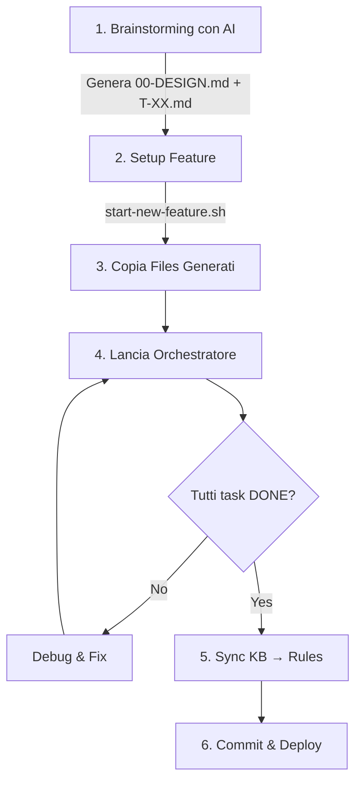

# Workflow Nuove Feature — Guida Completa

> **IMPORTANTE**: Segui questa procedura ESATTAMENTE per implementare nuove feature nel Trading System.
> Questo workflow garantisce coerenza, qualità e auto-apprendimento del sistema.

---

## Panoramica del Processo



**Tempo stimato**: 
- Brainstorming: 30-60 minuti
- Setup: 5 minuti
- Implementazione: variabile (dipende da complessità feature)
- Finalizzazione: 15 minuti

---

## STEP 1: Brainstorming con AI Esterno

### 1.1 Prepara il Prompt

**File da usare**: [`docs/BRAINSTORMING-PROMPT-TEMPLATE.md`](./BRAINSTORMING-PROMPT-TEMPLATE.md)

Apri il file template e:
1. Sostituisci `[NOME-FEATURE]` con il nome della feature (es: "Alert System Real-Time")
2. Sostituisci `[OBIETTIVO-BUSINESS]` con lo scopo business (es: "Notificare via email quando posizione raggiunge +10% o -5%")
3. Compila la sezione "Dettagli Feature" con requisiti specifici

### 1.2 Esegui Brainstorming

**Tool consigliati**:
- ChatGPT (GPT-4 o o1-preview)
- Claude (claude-3-5-sonnet o opus)
- Gemini Advanced

**Come procedere**:
```
1. Apri una nuova chat con l'AI
2. Copia & incolla il prompt compilato dal template
3. L'AI genererà:
   - 00-DESIGN.md (design document completo)
   - T-00.md, T-01.md, ... T-XX.md (task files)
```

### 1.3 Salva Output

**IMPORTANTE**: Salva TUTTO l'output dell'AI in file temporanei:

```bash
# Crea directory temporanea
mkdir -p /tmp/trading-feature-analysis

# Salva output AI
# - 00-DESIGN.md → /tmp/trading-feature-analysis/00-DESIGN.md
# - T-00.md → /tmp/trading-feature-analysis/T-00.md
# - T-01.md → /tmp/trading-feature-analysis/T-01.md
# ... etc
```

**Verifica che l'AI abbia prodotto**:
- [ ] `00-DESIGN.md` completo (tutte le sezioni compilate)
- [ ] `T-00.md` (setup task)
- [ ] `T-01.md`, `T-02.md`, ... (implementation tasks)
- [ ] Almeno 1 task di testing (es: T-XX con integration tests)

---

## STEP 2: Setup Feature

### 2.1 Esegui Script di Setup

**Bash (Linux/Mac/WSL)**:
```bash
cd /path/to/trading-system
./scripts/start-new-feature.sh "nome-feature"
```

**PowerShell (Windows)**:
```powershell
cd C:\path\to\trading-system
.\scripts\Start-NewFeature.ps1 -FeatureName "nome-feature"
```

**Esempio concreto**:
```bash
./scripts/start-new-feature.sh "alert-system"
# Output: Feature directory creato in: feature-202604-alert-system
```

### 2.2 Cosa fa lo script

1. ✅ Archivia build precedente in `docs/archive/YYYYMM-build/`
2. ✅ Reset `.agent-state.json` (tutti task → pending)
3. ✅ Crea directory:
   - `docs/trading-system-docs/feature-YYYYMM-nome-feature/`
   - `.claude/agents/feature-YYYYMM-nome-feature/`
4. ✅ Crea template vuoto `00-DESIGN.md`
5. ✅ Crea template `T-00-setup.md`
6. ✅ Mostra reminder su knowledge base

### 2.3 Annota Feature Directory

Lo script stamperà:
```
✅ Feature Setup Complete!
📂 Feature: feature-202604-alert-system
```

**ANNOTA QUESTO NOME** — ti serve per gli step successivi.

---

## STEP 3: Copia Files Generati dall'AI

### 3.1 Identifica Directory Target

Dallo STEP 2, hai ottenuto il nome feature directory, esempio:
```
FEATURE_DIR=feature-202604-alert-system
```

### 3.2 Copia Design Document

```bash
# Bash
cp /tmp/trading-feature-analysis/00-DESIGN.md \
   docs/trading-system-docs/$FEATURE_DIR/00-DESIGN.md

# PowerShell
Copy-Item "C:\Temp\trading-feature-analysis\00-DESIGN.md" `
          "docs\trading-system-docs\$FEATURE_DIR\00-DESIGN.md"
```

### 3.3 Copia Task Files

```bash
# Bash
cp /tmp/trading-feature-analysis/T-*.md \
   .claude/agents/$FEATURE_DIR/

# PowerShell
Copy-Item "C:\Temp\trading-feature-analysis\T-*.md" `
          ".claude\agents\$FEATURE_DIR\"
```

### 3.4 Verifica Files Copiati

```bash
# Check design doc
cat docs/trading-system-docs/$FEATURE_DIR/00-DESIGN.md | head -20

# Check task files
ls -la .claude/agents/$FEATURE_DIR/
# Dovresti vedere: T-00.md, T-01.md, T-02.md, ...
```

**Checklist**:
- [ ] `00-DESIGN.md` in `docs/trading-system-docs/feature-YYYYMM-nome/`
- [ ] Tutti i `T-XX.md` in `.claude/agents/feature-YYYYMM-nome/`
- [ ] I file sono leggibili e completi (non troncati)

---

## STEP 4: Lancia Orchestratore

### 4.1 Verifica Prerequisiti

```bash
# Check .NET SDK
dotnet --version
# Expected: 10.0.x

# Check build pulito
dotnet build TradingSystem.sln
# Expected: Build succeeded. 0 Error(s)

# Check git status (opzionale ma consigliato)
git status
# Expected: working tree clean (o solo untracked files)
```

### 4.2 Esegui Orchestratore

**Opzione A: Automatico - Auto-detect (CONSIGLIATO)**

```bash
# Bash - auto-detect numero task
./scripts/run-agents.sh feature-202604-alert-system

# PowerShell - auto-detect numero task
.\scripts\Run-Agents.ps1 -FeatureDir feature-202604-alert-system
```

**Gli script auto-detectano** quanti task T-XX.md ci sono nella directory e li eseguono tutti.

**Opzione A-bis: Specifica range manualmente**

```bash
# Bash - se vuoi eseguire solo T-00 a T-05
./scripts/run-agents.sh feature-202604-alert-system 0 5

# PowerShell - se vuoi eseguire solo T-00 a T-05
.\scripts\Run-Agents.ps1 -FeatureDir feature-202604-alert-system `
                         -StartTask 0 -EndTask 5
```

**Opzione B: Manuale (task singolo)**

Se preferisci controllare ogni task:

```bash
# Esegui T-00
claude --file .claude/agents/feature-202604-alert-system/T-00-setup.md \
       --file CLAUDE.md \
       --file knowledge/errors-registry.md \
       --file knowledge/lessons-learned.md \
       --prompt "Execute this task. Use /mem-search if claude-mem available."

# Verifica T-00 completato
jq '.["T-00"]' .agent-state.json
# Expected: "done"

# Ripeti per T-01, T-02, ...
```

### 4.3 Monitoraggio Esecuzione

Durante l'esecuzione, controlla:

```bash
# Check stato task
jq '.' .agent-state.json

# Check logs
tail -f logs/T-00-result.md
tail -f logs/T-01-result.md

# Check build (dopo ogni task)
dotnet build
dotnet test --no-build
```

### 4.4 Gestione Errori

Se un task fallisce:

```bash
# 1. Leggi il log del task fallito
cat logs/T-XX-result.md

# 2. Identifica root cause
# 3. Fixa il problema (manualmente o con Claude)
# 4. Re-esegui il task specifico
claude --file .claude/agents/$FEATURE_DIR/T-XX-nome.md \
       --file CLAUDE.md \
       --prompt "Retry this task. Previous error: [descrivi errore]"

# 5. Continua con task successivi
```

---

## STEP 5: Finalizzazione (Dopo TUTTI i Task DONE)

### 5.1 Verifica Completamento

```bash
# Check: tutti i task devono essere "done"
jq '.' .agent-state.json
# Expected:
# {
#   "T-00": "done",
#   "T-01": "done",
#   ...
#   "T-09": "done"
# }

# Check: build pulito
dotnet build TradingSystem.sln
# Expected: 0 Error(s)

# Check: test pass
dotnet test
# Expected: Passed! - Total: X
```

### 5.2 Esegui Test Suite Completa

```bash
# E2E verification
./scripts/verify-e2e.sh          # Bash
.\scripts\verify-e2e.ps1         # PowerShell

# Pre-deployment checklist
./scripts/pre-deployment-checklist.sh
```

**Risultato atteso**: 
```
✅ RESULT: READY FOR E2E TESTING
```

### 5.3 Sync Knowledge Base → Rules

**✨ NOVITÀ**: Se hai usato `run-agents.sh`, questo step è **GIÀ STATO ESEGUITO AUTOMATICAMENTE**!

**Solo se hai eseguito i task manualmente** (uno alla volta):

```bash
# Bash
./scripts/sync-kb-to-rules.sh

# PowerShell
.\scripts\Sync-KBToRules.ps1
```

**Cosa fa**:
1. Estrae errori CRITICAL da `knowledge/errors-registry.md`
2. Genera `.claude/rules/error-prevention.md`
3. Estrae lezioni ARCHITECTURE da `knowledge/lessons-learned.md`
4. Genera `.claude/rules/architectural-decisions.md`
5. Genera `.claude/rules/performance-rules.md`

**Output atteso**:
```
✅ Sync Complete
  - .claude/rules/error-prevention.md (15 rules)
  - .claude/rules/architectural-decisions.md (8 rules)
  - .claude/rules/performance-rules.md (12 rules)
```

**PERCHÉ È CRITICO**:
Queste rules verranno caricate automaticamente nella **prossima** feature,
prevenendo di ripetere errori già risolti.

### 5.4 Genera Report Finale (Opzionale)

```bash
cat > IMPLEMENTATION_REPORT.md << EOF
# Feature: [Nome Feature] — Implementation Report

**Data completamento**: $(date +%Y-%m-%d)
**Task eseguiti**: T-00 a T-XX
**Feature directory**: $FEATURE_DIR

## Summary
[Descrizione 2-3 frasi di cosa è stato implementato]

## Tasks Completed
$(jq -r 'to_entries | .[] | "- \(.key): \(.value)"' .agent-state.json)

## Knowledge Base Updates

### Nuovi Errori Risolti
$(grep "^## ERR-" knowledge/errors-registry.md | tail -5)

### Nuove Lezioni Apprese
$(grep "^- LESSON-" knowledge/lessons-learned.md | tail -5)

### Rules Sincronizzate
$(ls -1 .claude/rules/*.md)

## Test Results
- Unit tests: PASS
- Integration tests: PASS
- E2E checklist: PASS
- Pre-deployment: PASS

## Next Steps
[Se applicabile: deploy, monitoring, etc.]

---
**Generato da**: WORKFLOW-NUOVE-FEATURE.md
EOF
```

---

## STEP 6: Commit & Deploy

### 6.1 Review Changes

```bash
# Check files modificati
git status

# Check diff (se vuoi)
git diff src/
git diff dashboard/
```

### 6.2 Commit

```bash
git add .

git commit -m "feat: [Nome Feature] implementation

- Completati task T-00 a T-XX
- [Descrizione breve funzionalità]
- Aggiornate KB: Y errori, Z lezioni
- Sincronizzate rules per prossima feature

Test suite: PASS

Co-Authored-By: Claude Opus 4.6 <noreply@anthropic.com>"
```

### 6.3 Deploy (se applicabile)

**Windows Services**:
```powershell
cd infra\windows
.\update-services.ps1
```

**Cloudflare Worker**:
```bash
cd infra/cloudflare/worker
./scripts/deploy.sh
```

**Dashboard**:
```bash
cd dashboard
bun run build
./scripts/deploy.sh
```

---

## Checklist Finale

Prima di considerare la feature COMPLETA:

- [ ] Tutti i task: `"done"` in `.agent-state.json`
- [ ] `dotnet build` → 0 errori
- [ ] `dotnet test` → 100% pass
- [ ] `./scripts/verify-e2e.sh` → PASS
- [ ] `./scripts/pre-deployment-checklist.sh` → 0 failures
- [ ] **SYNC KB → RULES ESEGUITO** (`sync-kb-to-rules.sh`)
- [ ] `.claude/rules/` aggiornato con discoveries
- [ ] `IMPLEMENTATION_REPORT.md` generato (opzionale)
- [ ] Changes committati con message descrittivo
- [ ] Deploy completato (se applicabile)
- [ ] Servizi verificati in running state

**Se anche UNO di questi è rosso → Feature NON completa**

---

## Troubleshooting Comune

### Problema: "Task file not found"

```bash
# Check feature directory name
ls -la .claude/agents/
# Usa il nome ESATTO da start-new-feature output

# Verifica files copiati
ls -la .claude/agents/feature-YYYYMM-nome/
```

### Problema: "Build failed dopo task T-XX"

```bash
# Leggi errore compilazione
dotnet build 2>&1 | tee build-error.log

# Check cosa ha modificato il task
git diff

# Ripristina se necessario
git checkout -- path/to/broken/file.cs

# Re-esegui task con fix
```

### Problema: "claude-mem not available"

```bash
# Verifica installazione
claude --list-skills | grep claude-mem

# Se non installato (opzionale)
# Continua senza — usa KB files invece
grep -i "keyword" knowledge/errors-registry.md
```

### Problema: "sync-kb-to-rules.sh trova 0 errori"

```bash
# Check se errors-registry ha errori marcati CRITICAL
grep -i "CRITICAL" knowledge/errors-registry.md

# Se vuoto, aggiungi severity agli errori importanti
# Edita knowledge/errors-registry.md:
## ERR-042: SQLite database locked
Severity: CRITICAL   ← Aggiungi questa riga
...
```

---

## Template Files Reference

| File | Location | Purpose |
|---|---|---|
| **Brainstorming Prompt** | `docs/BRAINSTORMING-PROMPT-TEMPLATE.md` | Template per AI brainstorming |
| **Brainstorming Output Guide** | `docs/brainstorming-output-template.md` | Guida completa output AI |
| **Workflow (questo file)** | `docs/WORKFLOW-NUOVE-FEATURE.md` | Procedura step-by-step |
| **start-new-feature script** | `scripts/start-new-feature.sh` | Setup automatico feature |
| **sync-kb-to-rules script** | `scripts/sync-kb-to-rules.sh` | Sincronizzazione KB → Rules |
| **Orchestrator script** | `scripts/run-agents.sh` | Esecuzione automatica task |

---

## Quick Reference Card

```
┌─────────────────────────────────────────────────────────────┐
│ NUOVA FEATURE — QUICK REFERENCE                             │
├─────────────────────────────────────────────────────────────┤
│ 1. BRAINSTORM                                               │
│    cp docs/BRAINSTORMING-PROMPT-TEMPLATE.md → AI tool      │
│    Salva output in /tmp/feature-analysis/                   │
│                                                             │
│ 2. SETUP                                                    │
│    ./scripts/start-new-feature.sh "nome-feature"           │
│    Annota: FEATURE_DIR                                      │
│                                                             │
│ 3. COPY FILES                                               │
│    cp /tmp/.../00-DESIGN.md docs/.../FEATURE_DIR/          │
│    cp /tmp/.../T-*.md .claude/agents/FEATURE_DIR/          │
│                                                             │
│ 4. RUN                                                      │
│    ./scripts/run-agents.sh FEATURE_DIR 0 N                 │
│                                                             │
│ 5. FINALIZE                                                 │
│    ./scripts/verify-e2e.sh                                 │
│    ./scripts/sync-kb-to-rules.sh  ← CRITICAL!              │
│    git commit -m "feat: ..."                               │
│                                                             │
│ 6. DEPLOY                                                   │
│    (see DEPLOYMENT.md)                                      │
└─────────────────────────────────────────────────────────────┘
```

---

**Versione**: 1.0  
**Ultimo aggiornamento**: 2026-04-05  
**Maintainer**: Trading System Team  
**Contatti**: lorenzo.padovani@padosoft.com
