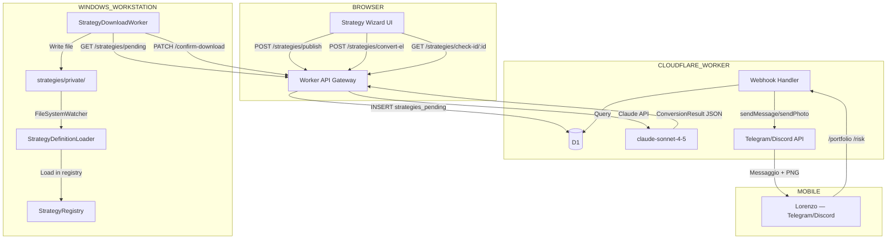

# 00-DESIGN.md — Strategy Wizard + Bot Telegram/Discord

> **Feature**: Strategy Wizard + Query Bot  
> **Data**: 2026-04-06  
> **Autore**: Lorenzo Padovani — Padosoft  
> **Stack**: .NET 10 · React 18 · Cloudflare Worker · D1 · Claude API

---

## 1. Analisi Requisiti

### Requisiti Funzionali

```
REQ-F-01: Creazione strategia SDF v1 via wizard guidato
  Given: L'utente apre la sezione Strategies della dashboard
  When: Clicca "Nuova Strategia"
  Then: Il wizard si apre allo step 1 (Identità)
    And: Ogni step mostra campi con tooltip contestuale
    And: La navigazione è bloccata se il step corrente ha errori

REQ-F-02: Validazione real-time per campo
  Given: L'utente sta compilando un campo del wizard
  When: Il valore cambia
  Then: La validazione viene eseguita entro 300ms
    And: Il messaggio di errore appare sotto il campo in rosso
    And: Il badge "N errori" in cima allo step si aggiorna

REQ-F-03: Import JSON esistente
  Given: L'utente ha un file JSON SDF v1 valido
  When: Lo trascina nella drop zone o lo seleziona
  Then: Tutti gli step del wizard vengono precompilati
    And: L'utente può modificare qualsiasi campo prima del publish
    And: La review mostra un diff rispetto all'originale

REQ-F-04: Conversione EasyLanguage → SDF v1 via AI
  Given: L'utente incolla codice EasyLanguage nel pannello converter
  When: Clicca "Converti con AI"
  Then: Il Worker chiama Claude API (claude-sonnet-4-5)
    And: Se convertibile: precompila il wizard con il JSON generato
    And: Se parziale: precompila i campi convertibili, evidenzia i mancanti
    And: Se non convertibile: mostra lista dettagliata degli issues
    And: La conversione viene loggata in D1.el_conversion_log

REQ-F-05: Publish strategia su Cloudflare D1
  Given: Il wizard è completo e senza errori bloccanti
  When: L'utente clicca "Pubblica su Cloud"
  Then: Il JSON viene inviato via POST /api/v1/strategies/publish
    And: Il record viene creato in D1.strategies_pending
    And: Il TradingSupervisorService scarica il file entro 60 secondi
    And: Il file viene scritto in strategies/private/{strategy_id}.json
    And: FileSystemWatcher rileva il nuovo file e lo carica automaticamente

REQ-F-06: Download JSON locale
  Given: Il wizard contiene una strategia (anche non ancora pubblicata)
  When: L'utente clicca "Scarica JSON"
  Then: Il browser scarica {strategy_id}.json
    And: Il file è un JSON SDF v1 valido e ben formattato

REQ-F-07: Bot Telegram/Discord — Menu principale
  Given: Il bot è configurato e attivo (ActiveBot = "telegram"|"discord")
  When: L'utente invia /start o /menu
  Then: Il bot risponde con un menu a bottoni inline
    And: I bottoni coprono: Portfolio, Status, Campagne, Mercato, Strategie, Alert, Risk, Snapshot

REQ-F-08: Bot — Query portfolio
  Given: L'utente preme [📊 Portfolio] o invia /portfolio
  When: Il Worker riceve il webhook
  Then: Esegue query diretta su D1 (no cache)
    And: Risponde con PnL oggi/MTD/YTD, campagne attive con semafori
    And: Invia immagine PNG gauge PnL con barre risk colorate
    And: Allega bottoni [🔄 Aggiorna] [🏠 Menu]

REQ-F-09: Bot — Risk check con semafori
  Given: L'utente chiede /risk
  When: Il Worker esegue query su campaign_states + portfolio_greek_snapshots
  Then: Per ogni campagna attiva mostra 6 parametri con semafori 🔴🟡🟢:
    - PnL vs Target, PnL vs Stop, Delta, Theta, SPX vs Wing, Giorni rimasti

REQ-F-10: Bot — Whitelist e autenticazione
  Given: Un utente non in whitelist invia un messaggio al bot
  When: Il Worker verifica il userId
  Then: Risponde "⛔ Non autorizzato" e non esegue nessuna query
    And: La firma del webhook (HMAC Telegram / Ed25519 Discord) viene sempre verificata

REQ-F-11: Bot — Lingua configurabile
  Given: BOT_LANGUAGE = "it" | "en" in configurazione Worker
  When: Il bot risponde a qualsiasi comando
  Then: Tutti i testi, label e descrizioni sono nella lingua configurata
```

### Requisiti Non-Funzionali

```
PERF-01: [Latenza Wizard] Validazione real-time < 50ms (client-side pura)
PERF-02: [Latenza Bot] Risposta bot entro 3 secondi (limite Telegram/Discord)
PERF-03: [Conversione AI] Timeout EL→AI endpoint: 30 secondi max
PERF-04: [Download strategia] StrategyDownloadWorker polling ogni 60s

SEC-01: ANTHROPIC_API_KEY mai hardcoded — wrangler secret put
SEC-02: TELEGRAM_BOT_TOKEN e DISCORD_PUBLIC_KEY via wrangler secrets
SEC-03: Firma webhook verificata crittograficamente prima di ogni elaborazione
SEC-04: strategies/private/ in .gitignore — mai nel repo pubblico

OPS-01: Dashboard mostra stato download strategia (pending / downloaded / confirmed)
OPS-02: Bot invia alert "📥 Nuova strategia caricata" dopo ogni download riuscito
OPS-03: Log in D1.bot_command_log per ogni comando eseguito

REL-01: StrategyDownloadWorker: write atomico (tmp → move) per evitare file corrotti
REL-02: Publish idempotente: stesso strategy_id con overwrite=false → 409 (no duplicati)
REL-03: EL Converter: se generazione immagine PNG fallisce → invia solo testo (no crash)
REL-04: Bot: qualsiasi eccezione nel handler → risposta "❌ Errore" (no crash Worker)
```

### Edge Cases Critici

```
EDGE-01: strategy_id già esistente al publish
  → Worker risponde 409 conflict
  → Dashboard mostra dialog: [Sovrascrivi] [Scegli nuovo ID] [Annulla]
  → Se Sovrascrivi: overwrite=true nel payload, record aggiornato in D1

EDGE-02: JSON import non valido (schema errato o corrotto)
  → Parse JSON fallisce → messaggio errore specifico con riga/percorso
  → Wizard NON viene precompilato (stato rimane invariato)

EDGE-03: EasyLanguage con costrutti non supportati da SDF v1
  → convertible = "partial" o false
  → Lista issues con: costrutto EL, motivo, suggerimento alternativo
  → Utente può procedere manualmente se partial

EDGE-04: Supervisor offline durante publish
  → Il record rimane in D1.strategies_pending con downloaded_at = NULL
  → Alla ripresa del Supervisor: poll automatico recupera il pending
  → Nessuna perdita di dati

EDGE-05: Bot chiamato fuori orario mercato (greche stale)
  → Risk check mostra ⚪ per metriche greche stale
  → Nota esplicita: "Dati greche aggiornati all'ultima chiusura"

EDGE-06: Discord PING verification (obbligatoria al setup)
  → Worker risponde { type: 1 } senza eseguire nessuna query
  → Firma Ed25519 verificata anche per il PING

EDGE-07: Hard stop condition con reference_leg_id non più esistente (leg rimosso)
  → Validazione segnala errore: "Leg '{id}' non trovato nella struttura corrente"
  → Publish bloccato fino a correzione
```

---

## 2. Design Architetturale

### 2.1 Componenti Nuovi

```
Component: Strategy Wizard UI
Location: dashboard/src/components/strategy-wizard/
Type: React 18 + TypeScript + Zustand

Responsabilità:
- Wizard 10 step per creazione/edit strategia SDF v1
- Validazione real-time client-side
- Import JSON con precompilazione
- EasyLanguage Converter Panel (split-pane)
- Step 10: Review + JSON Preview + Publish

Files:
- WizardContainer.tsx        (layout shell 3 colonne)
- StepIndicator.tsx          (barra step animata)
- wizardStore.ts             (Zustand store globale)
- sdf-v1.ts                  (tipi TypeScript completi)
- sdf-validator.ts           (validazione client-side)
- sdf-defaults.ts            (valori default ogni campo)
- steps/Step01-10.tsx        (10 step componenti)
- shared/LegBuilder.tsx      (drag & drop legs)
- shared/DeltaSlider.tsx     (slider delta con colori)
- shared/JSONPreview.tsx     (preview syntax-highlighted)
- el-converter/*.tsx         (pannello EL converter)

Dependencies:
- zustand + immer (state)
- motion (animazioni)
- lodash (set/get path annidati)

Component: Bot Query System
Location: infra/cloudflare/worker/src/bot/
Type: TypeScript (Cloudflare Worker)

Responsabilità:
- Webhook handler Telegram (HMAC) e Discord (Ed25519)
- Whitelist user ID
- Router comandi/callback
- Query D1 dirette per ogni comando
- Logica semafori 🔴🟡🟢
- Formatter messaggi Markdown
- Generazione PNG gauge (resvg-wasm)
- i18n IT/EN

Files:
- auth.ts                    (firma HMAC/Ed25519 + whitelist)
- dispatcher.ts              (router comandi)
- i18n.ts                    (stringhe IT/EN)
- semaphores.ts              (logica colori metriche)
- queries/*.ts               (6 query D1)
- formatters/*.ts            (5 formatter testo)
- images/portfolio-gauge.ts  (SVG gauge)
- image-generator.ts         (SVG→PNG resvg-wasm)
- keyboards/*.ts             (inline keyboards)
```

### 2.2 Componenti Modificati

```
Component: Cloudflare Worker (infra/cloudflare/worker/src/index.ts)
Changes:
- Aggiungere route: /api/v1/strategies/publish
- Aggiungere route: /api/v1/strategies/convert-el
- Aggiungere route: /api/v1/strategies/pending
- Aggiungere route: /api/v1/strategies/:id/confirm-download
- Aggiungere route: /api/v1/strategies/check-id/:id
- Aggiungere route: /api/v1/bot/telegram/webhook
- Aggiungere route: /api/v1/bot/discord/webhook
Rationale: Il Worker è il gateway unico — estensione naturale

Component: TradingSupervisorService
Changes:
- Aggiungere StrategyDownloadWorker (poll D1 → scrivi file → confirm)
- Aggiungere BotWebhookRegistrar (registra webhook all'avvio)
- Aggiungere AlertBuilder.StrategyDownloaded()
Rationale: Il Supervisor gestisce già sync cloud → estensione coerente

Component: D1 Schema (wrangler migrations)
Changes:
- Migration 0002: strategies_pending, el_conversion_log
- Migration 0003: bot_command_log
Rationale: Nuove tabelle isolate, zero impatto su tabelle esistenti
```

### 2.3 Data Flow



### 2.4 Database Schema Changes

```sql
-- Migration 0002: strategies_wizard
-- File: infra/cloudflare/worker/migrations/0002_strategies_wizard.sql

CREATE TABLE IF NOT EXISTS strategies_pending (
  id            INTEGER PRIMARY KEY AUTOINCREMENT,
  strategy_id   TEXT UNIQUE NOT NULL,
  json_content  TEXT NOT NULL,
  schema_version INTEGER NOT NULL DEFAULT 1,
  created_at    TEXT NOT NULL DEFAULT (datetime('now')),
  downloaded_at TEXT,           -- NULL = non ancora scaricato
  confirmed_at  TEXT,           -- NULL = non ancora confermato dal Supervisor
  overwrite     INTEGER NOT NULL DEFAULT 0,
  file_hash     TEXT NOT NULL
);
CREATE INDEX IF NOT EXISTS idx_pending_not_downloaded
  ON strategies_pending(created_at)
  WHERE downloaded_at IS NULL;

CREATE TABLE IF NOT EXISTS el_conversion_log (
  id                  INTEGER PRIMARY KEY AUTOINCREMENT,
  converted_at        TEXT NOT NULL DEFAULT (datetime('now')),
  el_code_hash        TEXT NOT NULL,
  convertible         TEXT NOT NULL,   -- 'true' | 'false' | 'partial'
  confidence          REAL,
  result_strategy_id  TEXT,
  issues_json         TEXT,
  published           INTEGER NOT NULL DEFAULT 0
);

-- Migration 0003: bot_commands_log
-- File: infra/cloudflare/worker/migrations/0003_bot_commands_log.sql

CREATE TABLE IF NOT EXISTS bot_command_log (
  id          INTEGER PRIMARY KEY AUTOINCREMENT,
  executed_at TEXT NOT NULL DEFAULT (datetime('now')),
  bot_type    TEXT NOT NULL,   -- 'telegram' | 'discord'
  user_id     TEXT NOT NULL,
  command     TEXT NOT NULL,
  response_ok INTEGER NOT NULL DEFAULT 0,
  error       TEXT
);
CREATE INDEX IF NOT EXISTS idx_bot_log_user
  ON bot_command_log(user_id, executed_at DESC);
```

**Rationale scelte schema:**
- `strategies_pending.downloaded_at`: permette al Worker di sapere cosa non è ancora stato scaricato (indice parziale WHERE downloaded_at IS NULL per performance)
- `el_conversion_log.published`: traccia se una conversione è stata poi pubblicata (analytics)
- `bot_command_log`: audit trail per debugging e monitoring utilizzo bot

---

## 3. Task Breakdown

### Parallelismo Task

```
WAVE 1 (start):
  └─ T-SW-01: SDF v1 Types + Validator + Defaults  [nessuna dipendenza]

WAVE 2 (dopo T-SW-01):
  ├─ T-SW-02: Zustand Wizard Store + Routing       [dipende: T-SW-01]
  └─ T-SW-07: EL Converter Worker Endpoint         [dipende: T-SW-01, infra Worker]

WAVE 3 (dopo T-SW-02):
  └─ T-SW-03: UI Shell + Design System             [dipende: T-SW-02]

WAVE 4 (dopo T-SW-03):
  ├─ T-SW-04: Steps 1-5 (Identity → Structure)     [dipende: T-SW-03]
  ├─ T-SW-08: Worker Publish + D1 + Download Worker[dipende: T-SW-01]
  └─ T-BOT-01: Bot Webhook + Auth + i18n           [dipende: Worker esistente]

WAVE 5 (dopo T-SW-04):
  ├─ T-SW-05: Steps 6-9 (Selection → Monitoring)   [dipende: T-SW-04]
  └─ T-BOT-02: D1 Queries + Formatters + Semaphores[dipende: T-BOT-01]

WAVE 6 (dopo T-SW-05 + T-SW-07 + T-SW-08):
  └─ T-SW-06: Step 10 Review + Publish UI          [dipende: T-SW-05, T-SW-07, T-SW-08]

WAVE 7 (dopo T-BOT-02):
  ├─ T-BOT-03: Image Generator PNG                 [dipende: T-BOT-02]
  └─ T-BOT-04: Keyboards + Discord Slash Commands  [dipende: T-BOT-02]

PERCORSO CRITICO:
T-SW-01 → T-SW-02 → T-SW-03 → T-SW-04 → T-SW-05 → T-SW-06
```

### Riepilogo Task

| ID | Titolo | Dipende | Stima | Wave |
|---|---|---|---|---|
| T-SW-01 | SDF v1 Types + Validator + Defaults | — | 1g | 1 |
| T-SW-02 | Zustand Wizard Store + Routing | T-SW-01 | 1g | 2 |
| T-SW-03 | UI Shell + Design System + Componenti Base | T-SW-02 | 2g | 3 |
| T-SW-04 | Steps 1-5 (Identity → Structure) | T-SW-03 | 2g | 4 |
| T-SW-05 | Steps 6-9 (Selection → Monitoring) | T-SW-04 | 1.5g | 5 |
| T-SW-06 | Step 10 Review + Publish UI | T-SW-05, T-SW-07, T-SW-08 | 1.5g | 6 |
| T-SW-07 | EL Converter Panel + Worker AI Endpoint | T-SW-02 | 2g | 2 |
| T-SW-08 | Worker Publish Endpoints + D1 + StrategyDownloadWorker | T-SW-01 | 2g | 4 |
| T-BOT-01 | Bot Webhook + Auth + i18n + Router | T-08 esistente | 2g | 4 |
| T-BOT-02 | D1 Queries + Formatters + Semaphores | T-BOT-01 | 2g | 5 |
| T-BOT-03 | Image Generator PNG (Gauge) | T-BOT-02 | 1.5g | 7 |
| T-BOT-04 | Keyboards + Discord Slash Commands | T-BOT-02 | 1g | 7 |

**TOTALE STIMA**: ~17.5 giorni/uomo

---

## 4. Dependencies & Configuration

### NuGet Packages (aggiuntivi)

```xml
<!-- TradingSupervisorService.csproj — nessun nuovo package richiesto -->
<!-- StrategyDownloadWorker usa solo System.Text.Json (già incluso in .NET 10) -->
```

### NPM Packages (aggiuntivi dashboard)

```bash
bun add zustand immer lodash motion
bun add prism-react-renderer   # syntax highlighting JSONPreview
bun add @hello-pangea/dnd      # drag & drop LegBuilder

# Worker (resvg-wasm per PNG generation)
cd infra/cloudflare/worker
bun add @resvg/resvg-wasm @anthropic-ai/sdk
```

### Configuration Changes

```json
// src/TradingSupervisorService/appsettings.json — aggiunte
{
  "Bots": {
    "ActiveBot": "telegram",
    "Language": "it",
    "WhitelistUserIds": ["TUO_TELEGRAM_USER_ID"],
    "Telegram": {
      "Enabled": true,
      "BotToken": "",
      "WebhookSecret": "",
      "WebhookUrl": "https://TUO_WORKER.workers.dev/api/v1/bot/telegram/webhook"
    },
    "Discord": {
      "Enabled": false,
      "ApplicationId": "",
      "PublicKey": "",
      "BotToken": "",
      "GuildId": ""
    }
  },
  "StrategyDownload": {
    "PollIntervalSeconds": 60,
    "StrategiesFolder": "strategies/private"
  }
}
```

```toml
# wrangler.toml — aggiunte vars
[vars]
BOT_ACTIVE    = "telegram"
BOT_LANGUAGE  = "it"
BOT_WHITELIST = "TUO_TELEGRAM_USER_ID"
```

### Secrets (mai in file versionati)

```bash
wrangler secret put ANTHROPIC_API_KEY
wrangler secret put TELEGRAM_BOT_TOKEN
wrangler secret put TELEGRAM_WEBHOOK_SECRET
wrangler secret put DISCORD_PUBLIC_KEY
wrangler secret put DISCORD_BOT_TOKEN
```

---

## 5. Rischi & Mitigazioni

| ID | Rischio | Prob | Impatto | Mitigazione |
|---|---|---|---|---|
| R-01 | Claude API timeout nella conversione EL | Media | Medio | Timeout 30s + messaggio errore chiaro in UI |
| R-02 | resvg-wasm aumenta cold start Worker | Alta | Basso | Inizializzazione lazy (solo al primo uso) |
| R-03 | Telegram webhook signature bypass | Bassa | Critico | HMAC-SHA256 verificato PRIMA di qualsiasi elaborazione |
| R-04 | strategy_id collision (due publish simultanei) | Bassa | Medio | UNIQUE constraint D1 + 409 con dialog sovrascrittura |
| R-05 | File corrotto durante write (crash mid-write) | Bassa | Alto | Write atomico: tmp → File.Move (operazione atomica OS) |
| R-06 | Discord interaction timeout (> 3s) | Media | Medio | Deferred response per /snapshot + executionCtx.waitUntil |
| R-07 | steps hard_stop reference_leg_id stale (leg rimosso) | Alta | Medio | Validazione cross-field: check esistenza leg prima del publish |
| R-08 | ANTHROPIC_API_KEY esposta in logs | Bassa | Critico | Mai loggare headers o body delle richieste Anthropic |

**Priorità Mitigazioni**:
1. R-03 (Security firma): implementato in T-BOT-01 come PRIMA cosa
2. R-05 (File corrotto): implementato in T-SW-08 (write atomico)
3. R-07 (Validazione cross-field): implementato in T-SW-01 (validator)
4. R-08 (API key leak): no logging di secrets — CLAUDE.md safety rule

---

## 6. Rollback Plan

### Disable Wizard (config, no redeploy)
Il wizard è una nuova sezione — se causa problemi basta non navigarci.
Il resto della dashboard non è impattato.

### Disable Bot (config, no redeploy)
```json
// appsettings.json
{ "Bots": { "ActiveBot": "none" } }
// Restart TradingSupervisorService → BotWebhookRegistrar non registra webhook
```

### Rollback Worker routes (deploy)
```bash
# Rimuovere le route bot e wizard dal Worker
# Le route esistenti non sono modificate → zero regression
wrangler deploy
```

### Rollback D1 Migrations
```sql
-- Solo le tabelle nuove — zero impatto sulle esistenti
DROP TABLE IF EXISTS strategies_pending;
DROP TABLE IF EXISTS el_conversion_log;
DROP TABLE IF EXISTS bot_command_log;
```

### Rollback StrategyDownloadWorker
```bash
# Rimuovere il Worker dal Program.cs (commenta la riga AddHostedService)
# Restart servizio — strategies/private/ rimane invariata
```

**Rollback Time Estimate**: < 5 minuti (config), < 15 minuti (deploy Worker)

---

## 7. Success Criteria

### Functional Criteria

**Strategy Wizard**
- [ ] Wizard 10 step navigabili senza errori
- [ ] Validazione real-time su tutti i campi (< 300ms)
- [ ] Import JSON precompila correttamente tutti gli step
- [ ] EL→AI: strategia convertibile → precompila wizard
- [ ] EL→AI: strategia non convertibile → lista issues dettagliata
- [ ] Publish → JSON in D1.strategies_pending
- [ ] Supervisor scarica il file entro 60 secondi
- [ ] FileSystemWatcher carica strategia automaticamente
- [ ] Download JSON locale produce file SDF v1 valido

**Bot**
- [ ] /start → menu con 8 bottoni inline
- [ ] /portfolio → PnL + campagne + immagine gauge + semafori
- [ ] /risk → 6 parametri per campagna con colori 🔴🟡🟢
- [ ] /snapshot → 2 messaggi completi entro 3 secondi
- [ ] User non whitelist → "⛔ Non autorizzato"
- [ ] Firma webhook verificata (Telegram HMAC + Discord Ed25519)
- [ ] Lingua IT/EN configurabile da env var

### Non-Functional Criteria
- [ ] Validazione wizard: < 50ms (client-side pura)
- [ ] Risposta bot: < 3 secondi per tutti i comandi tranne /snapshot (deferred)
- [ ] Nessun secret in file versionati (ANTHROPIC_API_KEY, BOT_TOKEN, etc.)
- [ ] strategies/private/ esclusa da git (.gitignore)
- [ ] Write strategia: atomico (nessun file corrotto)
- [ ] Worker deploy senza errori: `wrangler deploy` exit code 0

### Testing Criteria
- [ ] T-SW-01: tutti i test tipi/validator PASS
- [ ] T-SW-02: tutti i test store PASS
- [ ] T-SW-03: tutti i test componenti UI PASS
- [ ] T-SW-08: tutti i test Worker endpoints PASS
- [ ] T-BOT-01: tutti i test auth/webhook PASS
- [ ] T-BOT-02: tutti i test query/semafori PASS
- [ ] No regression su test esistenti del progetto

---

## 8. Testing Strategy

### Unit Tests (T-SW-01, T-SW-02, T-BOT-02)

```typescript
// sdf-validator.test.ts
test('suspend_threshold > resume_threshold → no error', () => {
  const draft = { entry_filters: { ivts: {
    suspend_threshold: 1.15, resume_threshold: 1.10
  }}}
  const result = validateField('entry_filters.ivts.suspend_threshold', 1.15, draft)
  expect(result).toBeNull()
})

test('suspend_threshold <= resume_threshold → cross-field error', () => {
  const draft = { entry_filters: { ivts: {
    suspend_threshold: 1.10, resume_threshold: 1.10
  }}}
  const result = validateField('entry_filters.ivts.suspend_threshold', 1.10, draft)
  expect(result?.severity).toBe('error')
})
```

```typescript
// semaphores.test.ts
test('pnlVsStopSignal: 82% of stop → RED', () => {
  expect(pnlVsStopSignal(-4100, 5000)).toBe('🔴')
})
test('heartbeatSignal: 8 minutes → YELLOW', () => {
  expect(heartbeatSignal(8)).toBe('🟡')
})
```

### Integration Tests (T-SW-08, T-BOT-01)

```typescript
// Worker integration test (Miniflare / Vitest)
test('POST /strategies/publish → 200, record in D1', async () => {
  const res = await worker.fetch('/api/v1/strategies/publish', {
    method: 'POST',
    headers: { 'X-Api-Key': 'test-key', 'Content-Type': 'application/json' },
    body: JSON.stringify({ strategy: validSdfV1, overwrite: false })
  })
  expect(res.status).toBe(200)
  const body = await res.json()
  expect(body.status).toBe('pending_download')
})

test('POST /strategies/publish duplicate → 409', async () => {
  // Prima insert
  await worker.fetch('/api/v1/strategies/publish', { ... })
  // Seconda insert stesso ID
  const res = await worker.fetch('/api/v1/strategies/publish', { ... })
  expect(res.status).toBe(409)
})
```

### E2E Manual Checklist

```markdown
## E2E-StrategyWizard.md

Prerequisites:
- [ ] Dashboard accessibile e autenticata
- [ ] TradingSupervisorService running
- [ ] strategies/private/ directory esistente

Steps:
1. [ ] Crea nuova strategia via wizard (10 step)
2. [ ] Verifica validazione campo strategy_id con caratteri speciali → errore
3. [ ] Verifica che step 5 blocchi senza legs
4. [ ] Completa tutti gli step → click Pubblica
5. [ ] Verifica record in D1: GET /api/v1/strategies/pending → strategy presente
6. [ ] Attendi 60s → verifica file in strategies/private/{id}.json
7. [ ] Verifica strategia caricata nella lista dashboard
8. [ ] Import lo stesso JSON → wizard precompilato
9. [ ] Incolla EasyLanguage → Converti → verifica precompilazione

## E2E-Bot.md

Prerequisites:
- [ ] Bot Telegram configurato e webhook registrato
- [ ] Almeno 1 campagna attiva in paper trading

Steps:
1. [ ] Invia /start → menu con 8 bottoni visibile
2. [ ] Clicca [📊 Portfolio] → risposta con PnL e immagine gauge
3. [ ] Clicca [📉 Risk] → risk check con semafori per campagna
4. [ ] Invia /snapshot → 2 messaggi in sequenza
5. [ ] Clicca [🔄 Aggiorna] → stessi dati, aggiornati
6. [ ] Da account diverso (non whitelist) → "⛔ Non autorizzato"
7. [ ] Cambia BOT_LANGUAGE="en" → deploy → verifica lingua inglese
```

---

## 9. Documentation Updates

```markdown
### docs/ARCHITECTURE.md
Aggiungere sezione:
## Strategy Wizard
- Flusso: Browser → Worker → D1 → Supervisor → strategies/private/
- EL Converter: Browser → Worker → Claude API → Browser

## Bot Query System
- Flusso: Telegram/Discord → Worker Webhook → D1 → Risposta
- Sicurezza: HMAC Telegram / Ed25519 Discord + whitelist userID

### docs/CONFIGURATION.md
Aggiungere:
## Strategy Wizard
- ANTHROPIC_API_KEY (wrangler secret)
- StrategyDownload.PollIntervalSeconds

## Bot Configuration
- Bots.ActiveBot: "telegram" | "discord" | "none"
- Bots.Language: "it" | "en"
- Bots.WhitelistUserIds: ["userId"]
- Wrangler vars: BOT_ACTIVE, BOT_LANGUAGE, BOT_WHITELIST

### README.md
Aggiungere in "Features":
- ✅ Strategy Wizard guidato con validazione real-time
- ✅ Conversione EasyLanguage → SDF v1 via Claude AI
- ✅ Bot Telegram/Discord per query portfolio e risk
```
