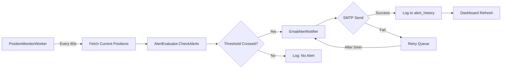

# Brainstorming Output Template

> **PURPOSE**: Questo template guida la fase di brainstorming/analisi con AI (ChatGPT, Claude, Gemini, ecc.)
> prima di eseguire l'implementazione con orchestratore.
>
> **QUANDO USARE**: Dopo aver deciso una nuova feature, ma PRIMA di eseguire `start-new-feature.sh`
>
> **OUTPUT**: Il risultato diventa `00-DESIGN.md` + task files (T-01.md, T-02.md, ...)

---

## Fase 1: Prompt per AI Brainstorming

Usa questo prompt con un AI di tua scelta per pianificare la feature:

```markdown
# CONTEXT: Trading System Architecture

Sto sviluppando un trading system automatizzato con questa architettura:

**Stack Tecnologico:**
- Backend: .NET 10, C# 13
- Database: SQLite (locale) + PostgreSQL (cloud via Cloudflare D1)
- Frontend: React 18 + TypeScript, Vite, Bun
- Infra: Cloudflare Workers (Hono framework)
- Trading API: Interactive Brokers TWS API

**Servizi Esistenti:**
1. **TradingSupervisorService** (Windows Service)
   - Monitora salute sistema
   - Raccoglie metriche (CPU, RAM, uptime)
   - Gestisce stato servizi
   - SQLite DB locale: `supervisor.db`

2. **OptionsExecutionService** (Windows Service)
   - Esegue strategie di trading options
   - Connessione IBKR TWS
   - Position tracking
   - Order management
   - SQLite DB locale: `options.db`

3. **Dashboard** (React SPA)
   - Monitoring real-time
   - Visualizzazione posizioni
   - Gestione strategie
   - React Query per data fetching

4. **Cloudflare Worker** (API Gateway)
   - Endpoint REST per dashboard
   - D1 database (PostgreSQL-compatible)
   - Replica dati da servizi locali

**Vincoli Non-Negoziabili:**
- ✅ TradingMode default = "paper" (mai "live" senza conferma esplicita)
- ✅ Rate limiting IBKR: max 1 order ogni 2 secondi
- ✅ SQLite: PRAGMA busy_timeout=5000, journal_mode=WAL
- ✅ Early return pattern (no else dopo return)
- ✅ Try/catch su ogni operazione IO con logging
- ✅ Typed signatures ovunque (no var per tipi non ovvi)

**🚨 TESTING POLICY — NON NEGOZIABILE 🚨**
- ✅ **OGNI task DEVE avere test specifici** (unit + integration dove applicabile)
- ✅ **Test DEVE passare al 100%** prima di considerare task DONE
- ✅ **LOOP finché test non passa**: Se test fallisce → fix → re-test → repeat
- ✅ **ZERO TOLERANCE**: Anche UN SOLO test fallito → task NON è DONE
- ✅ **TEST-FIRST approach**: Scrivi test PRIMA o INSIEME all'implementazione
- ✅ **INCREMENTAL testing**: Test per OGNI task, NON solo alla fine
- ✅ **NO "Test Omessi"**: Ogni Done Criteria DEVE includere "Tutti i test PASS"

**Knowledge Base Esistente:**
- 128+ lessons learned (errors-registry.md)
- Top 20 errori critici già risolti
- Performance patterns documentati

---

# FEATURE DA ANALIZZARE

**Nome Feature**: [INSERISCI QUI - es: "Alert System Real-Time via Email"]

**Obiettivo Business**: [INSERISCI QUI - es: "Notificare Lorenzo quando una posizione raggiunge +10% profit o -5% loss"]

**User Story** (se applicabile):
```
As a [trader]
I want to [receive email alerts when position thresholds are crossed]
So that [I can take timely action without monitoring dashboard 24/7]
```

---

# COMPITI AI

Analizza questa feature e produci:

## 1. Analisi Requisiti

### Requisiti Funzionali
Scrivi user stories in formato:
```
REQ-F-01: [Titolo]
  Given: [contesto/stato iniziale]
  When: [azione/trigger]
  Then: [risultato atteso]
  
Esempio:
REQ-F-01: Alert su Profit Threshold
  Given: Esiste una posizione aperta su SPY con entry price $400
    And: Esiste una regola alert "profit >= 10%"
  When: SPY sale a $440 (profit = 10%)
  Then: Sistema invia email a lorenzo@padosoft.com
    And: Alert viene loggato in alert_history table
    And: Alert non viene re-inviato fino a nuova entry
```

### Requisiti Non-Funzionali
```
PERF-01: [Latenza] Alert check deve completare in < 50ms per 100 posizioni
SEC-01: [Security] SMTP credentials in environment variables, mai hardcoded
OPS-01: [Operability] Dashboard mostra stato alert engine (enabled/disabled)
REL-01: [Reliability] Alert delivery garantito con retry (max 3 tentativi)
```

### Edge Cases Critici
```
EDGE-01: Cosa succede se SMTP server è down?
  → Fallback: Log alert in DB, retry dopo 5 minuti

EDGE-02: Cosa succede se posizione oscilla intorno a threshold?
  → Soluzione: Require threshold crossed for 2 consecutive checks (hysteresis)

EDGE-03: Cosa succede con 100+ posizioni che triggerano simultaneamente?
  → Soluzione: Rate limit 10 email/min, queue rimanenti
```

---

## 2. Design Architetturale

### 2.1 Componenti da Creare (nuovi)

Per ogni componente nuovo:
```
Component: AlertingEngine
Location: src/AlertingEngine/
Type: Class Library (.NET 10)

Responsabilità:
- Evaluate alert rules against current positions
- Trigger notifications when thresholds crossed
- Track alert history (prevent duplicates)

Files:
- AlertRule.cs (domain model)
- AlertEvaluator.cs (business logic)
- IAlertNotifier.cs (interface)
- EmailAlertNotifier.cs (impl: SMTP)
- Data/AlertRepository.cs (Dapper queries)

Dependencies:
- SharedKernel (domain primitives)
- MailKit (email sending)
- Serilog (logging)
```

### 2.2 Componenti da Modificare

Per ogni componente esistente modificato:
```
Component: OptionsExecutionService
File: Workers/PositionMonitorWorker.cs
Changes:
- Line ~45: Inject IAlertEvaluator
- Line ~120: After position update, call evaluator.CheckAlerts(position)
- Add error handling for alert failures (non deve bloccare position tracking)

Rationale: PositionMonitorWorker già monitora posizioni ogni 60s,
           è il punto ideale per triggerare alert check
```

### 2.3 Data Flow Diagram



### 2.4 Database Schema Changes

```sql
-- Migration: src/OptionsExecutionService/Data/Migrations/2026-04-XX-add-alert-tables.sql

CREATE TABLE alert_rules (
    id INTEGER PRIMARY KEY AUTOINCREMENT,
    symbol TEXT NOT NULL,                  -- es: "SPY", "AAPL"
    threshold_type TEXT NOT NULL,          -- "profit_pct", "loss_pct"
    threshold_value REAL NOT NULL,         -- es: 10.0 per +10%
    enabled INTEGER NOT NULL DEFAULT 1,
    created_at TEXT NOT NULL,
    updated_at TEXT NOT NULL,
    UNIQUE(symbol, threshold_type)
);

CREATE TABLE alert_history (
    id INTEGER PRIMARY KEY AUTOINCREMENT,
    rule_id INTEGER NOT NULL,
    position_id INTEGER NOT NULL,
    triggered_at TEXT NOT NULL,
    position_pnl_pct REAL NOT NULL,        -- PnL% al momento del trigger
    notification_sent INTEGER NOT NULL DEFAULT 0,
    notification_error TEXT,               -- se invio fallito
    FOREIGN KEY (rule_id) REFERENCES alert_rules(id),
    FOREIGN KEY (position_id) REFERENCES positions(id)
);

CREATE INDEX idx_alert_rules_symbol ON alert_rules(symbol) WHERE enabled = 1;
CREATE INDEX idx_alert_history_triggered ON alert_history(triggered_at DESC);
CREATE INDEX idx_alert_history_position ON alert_history(position_id);
```

**Rationale scelte schema:**
- `UNIQUE(symbol, threshold_type)`: Una sola regola profit e una loss per symbol
- `enabled` flag: Permette disable senza delete (audit trail)
- `notification_error`: Debug SMTP failures
- Indici: Performance per query dashboard (last 100 alerts)

---

## 3. Task Breakdown

Dividi la feature in task atomici (max 4 ore stima per task).

### Template per Task

```markdown
### T-XX: [Titolo Task]

**Obiettivo**: [1 frase - cosa produce questo task]

**Dipendenze**: [T-YY, T-ZZ] (quali task devono essere completati prima)

**Files da Creare**:
- path/to/NewFile.cs

**Files da Modificare**:
- path/to/ExistingFile.cs (line ~X, aggiungere Y)

**Test Criteria**:
- TEST-XX-01: [Descrizione test specifico - unit test]
- TEST-XX-02: [Descrizione test specifico - integration test]
- [Aggiungi tutti i test necessari per verificare il comportamento]

**Done Criteria** (TUTTI devono essere ✅ prima di considerare task DONE):
- [ ] Build pulito (dotnet build → 0 errori)
- [ ] **TUTTI i test T-XX-YY passano al 100%** (ZERO fallimenti accettati)
- [ ] **LOOP: Se anche UN SOLO test fallisce → fix → re-test → repeat finché non passa**
- [ ] No regression su test esistenti (tutti i test precedenti ancora PASS)
- [ ] Code review checklist (CLAUDE.md)
- [ ] Test scritti PRIMA o INSIEME all'implementazione (test-first approach)

**Execution Loop**:
```
1. Scrivi test per comportamento atteso
2. Implementa codice
3. Esegui test
4. Se PASS → Task DONE ✅
   Se FAIL → Analizza, fix, torna a step 3 🔄
```

**Stima**: ~2 ore
```

### ⚠️ IMPORTANTE - Task Naming Convention

**REGOLE OBBLIGATORIE**:
1. **SEMPRE** inizia da `T-00-setup.md` (task di setup infrastructure)
2. **SEMPRE** usa numerazione sequenziale: `T-00`, `T-01`, `T-02`, ...
3. **MAI** usare prefissi come `T-SW-01`, `T-BOT-01`, `T-FEATURE-01`
4. Anche se hai più feature/componenti, usa task sequenziali per tutti

**Esempio CORRETTO**:
```
T-00-setup.md           ← Setup infrastructure
T-01-wizard-step1.md    ← Wizard feature
T-02-wizard-step2.md    ← Wizard feature
T-03-bot-setup.md       ← Bot feature
T-04-bot-commands.md    ← Bot feature
```

**Esempio SBAGLIATO** ❌:
```
T-SW-01-step1.md   ← NO! Sistema non riconosce
T-SW-02-step2.md   ← NO! Sistema non riconosce
T-BOT-01-setup.md  ← NO! Sistema non riconosce
```

---

### Esempio Task Breakdown Completo

```
Phase 1: Foundation (Setup DB & Domain)
├─ T-00: Setup (OBBLIGATORIO - SEMPRE PRESENTE)
│  Obiettivo: Infrastructure setup + dependencies
│  Output: Secrets configurati, DB pronto, dependencies installate
│  Test: dotnet build → success, environment ready
│  Stima: 1h
│
├─ T-01: Database Schema
│  Obiettivo: Creare tabelle alert_rules, alert_history
│  Dipendenze: [T-00]
│  Output: 2026-04-XX-add-alert-tables.sql
│  Test: Migration executes, tables exist, indexes present
│  Stima: 1.5h
│
└─ T-02: Domain Models
   Obiettivo: AlertRule, AlertHistory records
   Dipendenze: [T-01]
   Output: Models/*.cs, unit tests
   Test: Record immutability, validation logic
   Stima: 2h

Phase 2: Business Logic
├─ T-03: AlertEvaluator
│  Obiettivo: Implementare logica threshold checking
│  Dipendenze: [T-02]
│  Output: AlertEvaluator.cs, unit tests
│  Test (TUTTI devono passare prima di DONE): 
│    - TEST-03-01: Profit 10% triggers alert (unit test)
│    - TEST-03-02: Loss 5% triggers alert (unit test)
│    - TEST-03-03: Hysteresis prevents re-trigger (unit test)
│  Done: Build clean + ALL tests PASS + loop finché non passa ✅
│  Stima: 3h
│
├─ T-04: EmailAlertNotifier
│  Obiettivo: Integrazione SMTP via MailKit
│  Dipendenze: [T-03]
│  Output: EmailAlertNotifier.cs, SMTP config
│  Test (TUTTI devono passare prima di DONE):
│    - TEST-04-01: Email sent successfully (mock SMTP)
│    - TEST-04-02: Retry on failure (integration test)
│    - TEST-04-03: Error logged if max retry exceeded (unit test)
│  Done: Build clean + ALL tests PASS + loop finché non passa ✅
│  Stima: 2.5h
│
└─ T-05: PositionMonitorWorker Integration
   Obiettivo: Hook alert check in existing worker
   Dipendenze: [T-04]
   Output: Modified PositionMonitorWorker.cs
   Test:
     - TEST-05-01: Alert checked after position update
     - TEST-05-02: Worker continues if alert fails
   Stima: 2h

Phase 3: Dashboard UI
├─ T-06: AlertsPage Component
│  Obiettivo: UI per visualizzare alert history
│  Dipendenze: [T-05]
│  Output: dashboard/src/features/alerts/AlertsPage.tsx
│  Test: Manual E2E (render 100 alerts, pagination)
│  Stima: 3h
│
└─ T-07: AlertRuleEditor Component
   Obiettivo: Form per creare/editare alert rules
   Dipendenze: [T-06]
   Output: AlertRuleEditor.tsx, Zod validation
   Test: 
     - TEST-07-01: Form validation (required fields)
     - TEST-07-02: API call on submit
   Stima: 2.5h

Phase 4: Testing & Integration
├─ T-08: Integration Tests
│  Obiettivo: End-to-end alert flow test
│  Dipendenze: [T-07]
│  Output: tests/Integration/AlertFlowTests.cs
│  Test:
│    - TEST-08-01: Create rule → position hits threshold → email sent → history logged
│  Stima: 3h
│
└─ T-09: E2E Manual Checklist
   Obiettivo: Verification checklist con IBKR Paper
   Dipendenze: [T-08]
   Output: tests/E2E/E2E-AlertSystem.md
   Test: Manual steps per verify in production-like env
   Stima: 1.5h

TOTAL STIMA: ~22 ore (3 giorni dev time)
```

### ❌ ANTI-PATTERNS DA EVITARE ❌

**MAI fare questo:**

1. **"Test alla fine" approach** ❌
   ```
   BAD: T-01 → T-02 → T-03 → ... → T-08 (Integration Tests) → T-09 (E2E)
   ❌ Tutti i task implementati senza test incrementali
   ❌ Scopri che il codice non funziona solo a fine feature
   ```

2. **"Test Omessi" placeholder** ❌
   ```
   BAD: 
   Done Criteria:
   - [ ] Build pulito
   - [ ] Test TODO (da fare dopo)  ← ❌ INACCETTABILE
   ```

3. **"Test opzionali"** ❌
   ```
   BAD:
   Test: Se tempo permette, aggiungere TEST-XX-01  ← ❌ INACCETTABILE
   ```

4. **"Avanti anche se test fallisce"** ❌
   ```
   BAD:
   TEST-03-01: FAIL (ma continuo con T-04 comunque)  ← ❌ INACCETTABILE
   ```

**SEMPRE fare questo:**

1. **Test incrementale per task** ✅
   ```
   GOOD: T-01 (+ TEST-01-XX) → PASS ✅ → T-02 (+ TEST-02-XX) → PASS ✅ → ...
   ```

2. **Done Criteria con test obbligatori** ✅
   ```
   GOOD:
   Done Criteria:
   - [ ] Build pulito
   - [ ] TUTTI i test T-XX-YY passano al 100% (ZERO fallimenti)
   - [ ] Loop finché non passa
   ```

3. **Loop se test fallisce** ✅
   ```
   GOOD:
   TEST-03-01: FAIL → Analizza → Fix → Re-test → Still FAIL → Fix again → PASS ✅
   Solo quando PASS → Task T-03 DONE
   ```

---

## 4. Dependencies & Configuration

### NuGet Packages
```xml
<!-- AlertingEngine.csproj -->
<PackageReference Include="MailKit" Version="4.4.0" />
<PackageReference Include="MimeKit" Version="4.4.0" />
<PackageReference Include="Dapper" Version="2.1.28" />
```

### Configuration Changes
```json
// src/OptionsExecutionService/appsettings.json
{
  "Alerting": {
    "Enabled": true,
    "CheckIntervalSeconds": 60,
    "Email": {
      "SmtpHost": "smtp.gmail.com",
      "SmtpPort": 587,
      "UseSsl": true,
      "FromAddress": "alerts@trading.local",
      "FromName": "Trading System Alerts",
      "ToAddress": "lorenzo@padosoft.com"
    },
    "RateLimits": {
      "MaxEmailsPerMinute": 10,
      "RetryAttempts": 3,
      "RetryDelaySeconds": 300
    }
  }
}
```

**Environment Variables** (secrets):
```bash
SMTP_USERNAME=lorenzo@padosoft.com
SMTP_PASSWORD=<app-specific-password>
```

---

## 5. Rischi & Mitigazioni

| ID | Rischio | Probabilità | Impatto | Mitigazione |
|---|---|---|---|---|
| R-01 | SMTP rate limiting (Gmail: 500/day) | Alta | Medio | Usare SendGrid (free tier: 100/day garantiti) |
| R-02 | Alert storm (100+ positions trigger) | Media | Alto | Rate limit 10 email/min + priority queue |
| R-03 | False positives (volatility spike) | Alta | Basso | Hysteresis: require 2 consecutive checks |
| R-04 | SMTP credentials leak | Bassa | Critico | Environment variables + .gitignore .env files |
| R-05 | Database lock (concurrent alert checks) | Media | Medio | SQLite busy_timeout=5000 (già implementato) |
| R-06 | PositionMonitor crash se alert fail | Media | Alto | Try/catch isolato, log error, continue worker |

**Priorità Mitigazioni**:
1. R-04 (Security): Implement FIRST (T-04)
2. R-06 (Reliability): Implement in T-05 (worker integration)
3. R-02 (Scalability): Implement in T-04 (rate limiter)
4. R-03 (Quality): Implement in T-03 (hysteresis logic)

---

## 6. Rollback Plan

Se alert system causa problemi in production:

### Step 1: Disable via Config (no deploy)
```json
// appsettings.json
{
  "Alerting": {
    "Enabled": false  // ← Set to false, restart service
  }
}
```

### Step 2: Database Rollback (se migration causa issue)
```sql
-- Rollback migration
DROP TABLE IF EXISTS alert_history;
DROP TABLE IF EXISTS alert_rules;
-- positions table rimane intatta (no impact)
```

### Step 3: Code Rollback (se bug critico)
```bash
# Revert to previous commit
git revert <commit-hash-alert-feature>

# Rebuild & redeploy
dotnet publish -c Release
./infra/windows/update-services.ps1
```

**Rollback Time Estimate**: < 5 minuti (config change), < 30 minuti (full rollback)

---

## 7. Success Criteria

### Functional Criteria
- [ ] Alert triggered quando position raggiunge +10% profit
- [ ] Alert triggered quando position raggiunge -5% loss
- [ ] Email arriva entro 2 minuti da trigger
- [ ] Nessun alert duplicato per stessa posizione/threshold
- [ ] Dashboard mostra alert history con timestamp

### Non-Functional Criteria
- [ ] Performance: Alert check < 50ms per 100 posizioni
- [ ] Reliability: 99% alert delivery success (monitored over 7 days)
- [ ] Security: No SMTP credentials in git repository
- [ ] Operability: Alert system enable/disable da dashboard senza redeploy

### Testing Criteria (ZERO TOLERANCE - TUTTI devono essere ✅)
- [ ] **Tutti i test unitari (T-03, T-04): 100% PASS** (se anche uno FAIL → loop fix/re-test)
- [ ] **Integration test (T-08): 100% PASS** (se FAIL → loop fix/re-test)
- [ ] **E2E manual checklist (T-09): 100% PASS** (se FAIL → loop fix/re-test)
- [ ] **No regression su existing tests: 100% PASS** (se anche uno regredisce → fix immediately)
- [ ] **Pre-deployment checklist: 100% PASS**

**Test Execution Loop**:
```
Per ogni task T-XX:
  1. Esegui test suite (dotnet test)
  2. Tutti PASS? 
     ├─ NO → Analizza root cause → Fix code → Torna a step 1 ⟲
     └─ YES → Task DONE ✅, procedi a T-XX+1

Feature completa solo quando TUTTI i task T-00 a T-N hanno test PASS ✅
```

---

## 8. Testing Strategy

**🚨 CRITICAL TESTING POLICY 🚨**
- Ogni task implementa test PRIMA o INSIEME al codice (test-first o test-driven)
- Test DEVONO passare al 100% prima di marcare task come DONE
- Se test fallisce → LOOP: analizza root cause → fix → re-test → repeat
- ZERO TOLERANCE: Anche UN SOLO test fallito → task NON è DONE
- NO "Test Omessi": Se un comportamento è richiesto, il test è OBBLIGATORIO

**Workflow per Ogni Task**:
```
START task T-XX
  ↓
Scrivi test per comportamento atteso (TEST-XX-01, TEST-XX-02, ...)
  ↓
Implementa codice per far passare i test
  ↓
Esegui test suite (dotnet test)
  ↓
Tutti PASS? 
  ├─ NO → Analizza failure, fix code, ripeti test ⟲ LOOP
  └─ YES → Verifica no regression → Task DONE ✅
```

**Esempio di Loop di Test che Fallisce**:
```
Iteration 1: TEST-03-01 FAIL (NullReferenceException)
  → Fix: Aggiunto null check in AlertEvaluator.cs:45
  → Re-test → Still FAIL (wrong logic)

Iteration 2: TEST-03-01 FAIL (threshold non rispettato)
  → Fix: Corretto calcolo PnL% in AlertEvaluator.cs:52
  → Re-test → PASS ✅
  → Verifica altri test → All PASS ✅
  → Task T-03 DONE ✅
```

### Unit Tests (T-03, T-04)
```csharp
// Example: AlertEvaluatorTests.cs
[Fact]
public void ShouldTriggerAlert_WhenProfitExceeds10Percent()
{
    // Arrange
    var position = new Position { EntryPrice = 100, CurrentPrice = 110 }; // +10%
    var rule = new AlertRule { ThresholdType = "profit_pct", ThresholdValue = 10.0 };
    var evaluator = new AlertEvaluator();

    // Act
    var shouldTrigger = evaluator.Evaluate(position, rule);

    // Assert
    Assert.True(shouldTrigger);
}
```

### Integration Tests (T-08)
```csharp
// Example: AlertFlowTests.cs
[Fact]
public async Task GivenPositionWith10PercentProfit_WhenMonitorRuns_ThenEmailSent()
{
    // Arrange: Setup DB, create alert rule, create position
    // Act: Run PositionMonitorWorker cycle
    // Assert: Check alert_history has entry, mock SMTP received email
}
```

### E2E Manual Checklist (T-09)
```markdown
# E2E-AlertSystem.md

## Prerequisites
- [ ] IBKR Paper Trading account attivo
- [ ] SMTP credentials configurati (environment variables)
- [ ] OptionsExecutionService running
- [ ] Dashboard accessible

## Test Steps
1. [ ] Create alert rule: SPY profit >= 10%
2. [ ] Open SPY position (100 shares @ $400)
3. [ ] Wait for SPY to reach $440 (simulate or wait market)
4. [ ] Verify email received within 2 minutes
5. [ ] Check dashboard alerts page shows entry
6. [ ] Verify alert_history table has record
7. [ ] Verify no duplicate email sent (check for 10 minutes)
8. [ ] Disable alert rule, verify no more emails

## Expected Results
- Email subject: "🚨 Alert: SPY Profit Threshold Reached"
- Email body contains: Position details, profit %, timestamp
- Dashboard shows alert with "Sent" status
```

---

## 9. Documentation Updates

Files da aggiornare dopo implementazione:

```markdown
### docs/ARCHITECTURE.md
Aggiungere sezione:
## Alert System
- Architecture diagram
- Data flow
- Component responsibilities

### docs/CONFIGURATION.md
Aggiungere:
## Alerting Configuration
- appsettings.json structure
- Environment variables
- SMTP setup guide

### README.md
Aggiungere in "Features":
- ✅ Real-time email alerts on position thresholds
```

---

# OUTPUT FINALE RICHIESTO

Alla fine del brainstorming, l'AI deve produrre:

1. **00-DESIGN.md** (file markdown compilato seguendo sections 1-9 sopra)
2. **Task Files** (T-00.md, T-01.md, ... T-09.md) con structure:
   ```markdown
   # T-XX — [Title]
   
   ## Obiettivo
   ## Dipendenze
   ## Checklist
   ## Implementazione (pseudo-code / guidance)
   ## Test
   ## Done Criteria
   ```

3. **Rischi Identificati** (summary in 00-DESIGN.md section 5)
4. **Success Criteria Misurabili** (section 7)

---

# ISTRUZIONI PER AI AGENT DURANTE IMPLEMENTAZIONE

**🤖 Se sei un AI agent (Claude, ChatGPT, etc.) che implementa questi task:**

## REGOLE OBBLIGATORIE PER OGNI TASK

### 1. Prima di Iniziare il Task
```
□ Leggi CLAUDE.md (regole codebase)
□ Leggi knowledge/errors-registry.md (errori da NON ripetere)
□ Leggi task file T-XX.md completamente
□ Identifica TUTTI i test richiesti (TEST-XX-01, TEST-XX-02, ...)
```

### 2. Durante Implementazione
```
□ Scrivi test PRIMA o INSIEME al codice (test-first approach)
□ Implementa codice per far passare i test
□ NON marcare task come DONE finché test non passano
```

### 3. Execution Loop (OBBLIGATORIO)
```
LOOP:
  1. Esegui: dotnet test
  2. Risultato?
     ├─ TUTTI PASS → Verifica no regression → Task DONE ✅ → EXIT LOOP
     └─ ANCHE SOLO 1 FAIL → Vai a step 3
  3. Analizza root cause del failure
  4. Fix del codice
  5. Torna a step 1 ⟲ CONTINUA LOOP

❌ MAI uscire dal loop finché test non passano
❌ MAI marcare task DONE se anche un solo test fallisce
❌ MAI saltare test "per dopo"
```

### 4. Quando Task è DONE
```
□ Tutti i test T-XX-YY: 100% PASS ✅
□ Tutti i test esistenti: 0 regression ✅
□ dotnet build: 0 errori ✅
□ Aggiorna .agent-state.json: "T-XX": "done"
□ Scrivi log in logs/T-XX-result.md
□ Aggiorna knowledge/ se hai scoperto errori o lezioni
```

### 5. Cosa NON Fare ❌
```
❌ "Test fallisce ma continuo con prossimo task"
❌ "Test scrivo alla fine di tutti i task"
❌ "Test è opzionale se tempo permette"
❌ "Test passa localmente quindi ok" (verifica sempre con dotnet test)
❌ "Ho fatto codice, test li fa l'utente"
```

### 6. Comunicazione con Utente
```
✅ "Task T-XX: test 12/12 PASS ✅, task DONE"
✅ "Task T-XX: test 3/12 FAIL, loop iteration 2 in progress..."
✅ "TEST-XX-03 fallisce per NullRef in line 45, fixing..."

❌ "Ho implementato T-XX" (senza dire se test passano)
❌ "Task completato" (se test non sono tutti verdi)
```

## ESEMPIO WORKFLOW CORRETTO

```
AI Agent esegue T-03:

[10:00] Inizio T-03: AlertEvaluator
[10:05] Scrivo test: TEST-03-01, TEST-03-02, TEST-03-03 (12 test totali)
[10:30] Implemento AlertEvaluator.cs
[10:45] Eseguo: dotnet test --filter "FullyQualifiedName~T03"
        → Risultato: 10/12 PASS, 2 FAIL ❌
        
[10:50] LOOP Iteration 1:
        - TEST-03-01 FAIL: NullReferenceException at line 45
        - Aggiungo null check
        - Re-test: 11/12 PASS, 1 FAIL ❌
        
[11:00] LOOP Iteration 2:
        - TEST-03-07 FAIL: Expected true, got false (threshold logic)
        - Fix calcolo PnL% in AlertEvaluator.cs:52
        - Re-test: 12/12 PASS ✅
        
[11:10] Verifica regression: dotnet test (all existing tests)
        → Risultato: 312/312 PASS ✅
        
[11:15] ✅ Task T-03 DONE
        - Aggiorno .agent-state.json: "T-03": "done"
        - Scrivo logs/T-03-result.md con dettagli 2 iterazioni loop
        - Comunico: "Task T-03 DONE: 12/12 test PASS dopo 2 iterazioni"
```

---

# COME USARE QUESTO OUTPUT

Dopo aver ricevuto l'output dall'AI:

```bash
# 1. Salva 00-DESIGN.md nella feature directory
cp ai-output/00-DESIGN.md docs/trading-system-docs/feature-202604-alerts/

# 2. Salva task files
cp ai-output/T-*.md .claude/agents/feature-202604-alerts/

# 3. Review manualmente per sanity check
cat docs/trading-system-docs/feature-202604-alerts/00-DESIGN.md

# 4. Esegui start-new-feature (se non già fatto)
./scripts/start-new-feature.sh "alert-system"

# 5. Lancia orchestratore
./scripts/run-agents.sh feature-202604-alerts 0 9
```

---

**Template Version**: 2.0  
**Last Updated**: 2026-04-06  
**Maintainer**: Trading System Team  
**Changelog v2.0**: Enhanced testing policy enforcement - LOOP-until-pass approach, ZERO tolerance for test failures, AI agent explicit instructions
